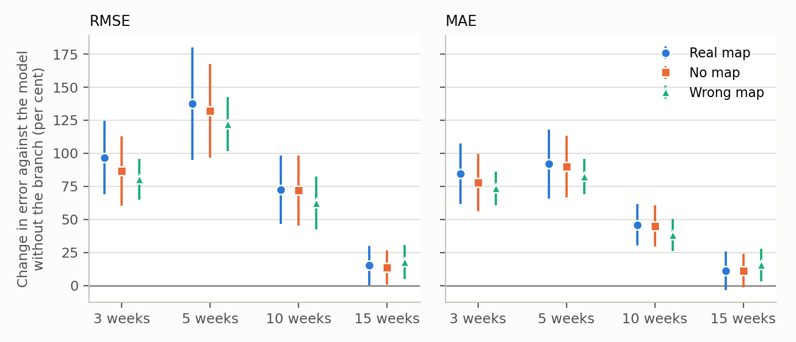
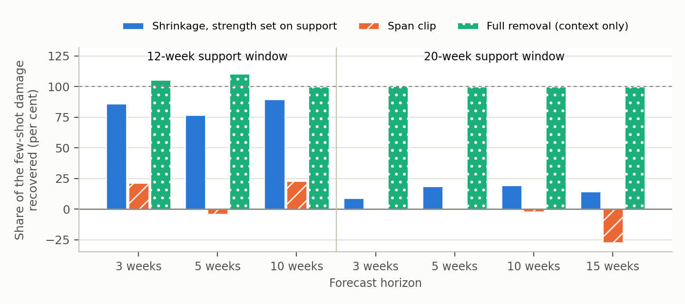
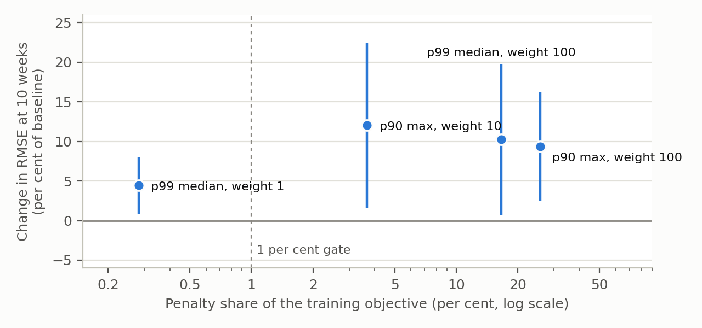

# Ablations, Classical Baselines and Robustness Checks

## 1. Scope

This phase tests, one at a time, the three components added to the framework to improve transfer: the spatial graph, the few-shot adapter and the epidemiology-informed penalty. It also adds classical baselines, a gradient-boosted model on lag features, SARIMA and ARIMA, beside the four published graph baselines. No new model is proposed. The Ebola pre-registration is not re-scored, and every new analysis that reads Ebola data is labelled exploratory.

The runs draw on five development panels: influenza in Japan, the US regions and the US states (47, 10 and 49 nodes), COVID in the US states (49 nodes), and dengue (6,161 scored districts in 12 countries). Ebola is held out of all training. Unless a section states otherwise, results are seed means over five seeds at horizons of 3, 5, 10 and 15 weeks, scored as country-macro RMSE and MAE in weekly case counts, where lower is better. Three tests were pre-registered, with the protocol hashed before any result existed: the spatial deviation branch, the penalty bound and weight sweep, and the downward adapter capacity test.

Three checks on figures already reported close the document before the summary. Table 1 gives the state of each deliverable.

**Table 1.** State of each deliverable.

| Deliverable | Status |
|---|---|
| Ablation study | Completed |
| Robustness checks | Completed |
| Finalised source code | Completed |
| Manuscript | In progress |

## 2. Classical baselines

Three classical models were added beside the four published graph baselines. The first is a gradient-boosted model (GBM) fitted on each node's recent case-count lags, pooled over the nodes of a panel, with one model per horizon. The other two are SARIMA and ARIMA, fitted per node with a fixed order. The seasonal term is used on the three influenza panels only, so SARIMA and ARIMA are identical on COVID and dengue by construction. All three use the same splits, forecast origins and country-macro scoring as the encoder.

Table 2 compares the classical models with the encoder and with persistence on the four panels where all of them are scored on the same nodes. Against the encoder, a cell counts as a difference when a two-sided t-test over the five seeds gives p < 0.05, paired by seed for GBM. GBM returns the same forecast on every seed on these panels, and persistence and SARIMA are deterministic, so the comparisons with persistence are exact.

**Table 2.** Cells where the classical model has lower error, no difference, or higher error than the comparator. Each entry covers 16 cells: four panels by four horizons.

| Comparison | RMSE (lower / none / higher) | MAE (lower / none / higher) |
|---|---|---|
| GBM against the encoder | 0 / 2 / 14 | 0 / 3 / 13 |
| SARIMA against the encoder | 2 / 4 / 10 | 2 / 3 / 11 |
| GBM against persistence | 8 / 0 / 8 | 8 / 0 / 8 |
| SARIMA against persistence | 13 / 0 / 3 | 13 / 0 / 3 |

GBM does not beat the encoder in any cell. It also forecasts worse than persistence in 8 of 16 cells: COVID at 3, 5 and 10 weeks, the US regions at every horizon and the US states at 3 weeks. SARIMA beats the encoder only on COVID, at 5 and 10 weeks on both metrics. It beats persistence everywhere except COVID at 3, 5 and 15 weeks. The seasonal term lowers ARIMA's RMSE by 1.8 to 28.3 per cent on the influenza panels, most on Japan.

Dengue is left out of Table 2. The classical models are scored on the 2,392-district subset the graph baselines use, while the encoder and persistence are scored on all 6,161 districts, so the two sets of numbers measure different quantities. SARIMA fell back to persistence on at least one forecast origin for 792 of the 2,392 districts (33.1 per cent). On the shared subset, both classical models beat EpiGNN at every horizon, GBM beats MTGNN on RMSE at 5 and 10 weeks and loses at 3 and 15, and SARIMA loses to MTGNN at every horizon. The encoder is not part of that comparison, so no result reported for the encoder changes.

An exploratory GBM arm was fitted on the Ebola support weeks alone and scored on the same query cells as the naive floors. The 12-week support window leaves no trainable target at 10 and 15 weeks, so those horizons fall back to persistence. On that window GBM beats both floors at 3 and 5 weeks on RMSE and at 5 weeks only on MAE. On the 20-week window it beats both floors in no cell. These are point comparisons without an interval.

Adding classical baselines changes the encoder's standing on one panel only: on COVID, SARIMA forecasts better at 5 and 10 weeks. GBM does not beat the encoder in any of the 32 cells.

## 3. The spatial chain

The spatial graph lets each district draw on its neighbours. Six tests follow the question from the raw data to the trained model (Table 3). For the retrain, the gate probe and the graph removal, a difference counts when the mean paired difference over the five seeds is larger than its standard deviation.

**Table 3.** The spatial tests in order, from the data to the model.

| Test | Result |
|---|---|
| District structure in inputs and representation | 13.8 to 93.5 per cent district-specific in the inputs, 3.8 to 22.4 per cent after the encoder |
| Neighbour signal in the raw data | Real neighbours beat relabelled maps in 13 of 20 cells |
| Retraining on a relabelled map | Real map helps in 9 of 60 cells, hurts in 2, no difference in 49 |
| Gate probe for a district-identity objective | Per-district correction beats both references in 2 of 40 cells |
| Deviation branch, pre-registered | Worse in 7 of 8 deciding cells, no difference in 1 |
| Whole-graph removal, exploratory | No difference in any of 16 error cells |

The raw incidence inputs carry district-specific structure and the encoder removes most of it, a 3.2 to 5.0 times reduction on every panel. This is measured on single-disease models at one seed, and energy alone does not show that the removed part was forecastable. A model-free probe finds that neighbours carry forecast information, but only COVID and dengue exceed 1 per cent of target variance, at most 5.3 per cent (COVID, 3 weeks). A win shows informative neighbours, not spread. On Ebola, in an exploratory run, the neighbour signal disappears once each district's own level is included: none at 3 and 5 weeks, and 10 weeks lacks the power to decide.

A model retrained on a map with the same topology but the wrong districts matches the real-map model in 49 of 60 cells. The real map helps almost only on dengue: correlation at every horizon, by 0.034 to 0.042, and error at 10 and 15 weeks, by 2.2 to 4.1 per cent. On influenza in Japan at 10 weeks the wrong map gives lower error. A per-district correction fitted after training, the cheap test of whether an auxiliary district-identity objective has a target, beats both no correction and a district-agnostic correction only on COVID at 10 weeks. A per-district slope and level never beats the uncorrected model and becomes unstable on dengue, reaching an RMSE of 3.07e7. The retrain with that objective was not run.

The deviation branch passes each district's departure from the weekly panel mean to its own spatial mixer. Under a pre-registered protocol on COVID with 15 seeds, it raised RMSE by 96.8 per cent at 3 weeks and 137.6 per cent at 5 weeks (Figure 1). A wrong map and no map did the same damage, so the harm comes from the deviation input, not the graph. The result is consistent with deviations dominated by noise at the capacity of a learned branch; the failure mechanism is not established. Under the protocol, no dengue run follows.

In an exploratory run on COVID and influenza in Japan, removing the whole graph, neighbour mixing and the degree feature together, moves none of the 16 error cells. Inside the graph the two parts pull in opposite directions at 5 weeks on both panels: mixing raises error and the degree feature lowers it by about the same amount. On Japan, mixing also raises RMSE at 3 weeks and MAE at 10 weeks. The interaction between the two parts was not tested.

The data carries some district and neighbour structure, the encoder compresses most of it, training barely needs the real map, and routing the structure back in made the model worse.

## 4. The adapter

On Ebola the adapted arm has a higher mean error than the unadapted one in 15 of 16 cells, a point comparison without an interval. The earlier geometric reading placed 76 to 85 per cent of what the adapter changes along directions where the query data reaches 5 to 11 times beyond the range the support data covered. Two tests follow that reading: one constrains the fitted adapter, the other asks whether a smaller adapter would do better.

The first test, exploratory, shrinks the fitted adapter toward the zero-effect map, the borrowed map that adds no Ebola-specific change. The strength is chosen by leave-one-district-out validation inside the support data, so no query cell is read (Figure 2). On the primary 12-week arm this recovers 77 to 90 per cent of the few-shot damage at 3, 5 and 10 weeks; the 15-week cell carries no damage. On the secondary 20-week arm it recovers 9 to 19 per cent, because the rule selects almost no shrinkage there (mean strength 0.88, where 1 means none, against 0.34 on the 12-week arm). Removing the few-shot change entirely recovers about 100 per cent on every damaged cell, but that setting is chosen with the answer in view. Deleting only the part of the change that acts outside the support span recovers 1.5 per cent on average, so the damage sits in the size of the change along weakly constrained directions rather than strictly outside the span.

The second test, pre-registered, replaces the affine adapter with smaller surfaces and compares each with an affine adapter fitted the same way, on RMSE over five seeds (Table 4). It runs as a simulation on a dengue-trained trunk: first read out on the three influenza panels with their full training data, then on Japan and the US states with Ebola's 12-week and 20-week support patterns imposed. A surface wins only when two panels agree on a statistically significant gain (paired 95 per cent t-interval) with no significant harm. A rank-10 read-out and both recalibrations are negative. A head-only read-out, which has the same function class as the affine adapter, changes no cell. Shrinkage toward the dengue adapter, with its strength fixed on the other panel's validation data, beats the affine adapter on the US states by 39 to 56 per cent where it clears, but never on Japan, so it is negative on the 12-week pattern and null on the 20-week pattern. No surface is positive. Re-read under the same rule, every larger surface from the earlier upward half shows both an agreed gain and a significant harm.

**Table 4.** Downward adapter capacity against the affine adapter. Positive: an agreed gain and no significant harm. Negative: a significant harm and no agreed gain. Null: neither.

| Surface | Setting | Verdict |
|---|---|---|
| Rank-10 read-out | Full training data | Negative |
| Head-only read-out | Full training data | Null |
| Intercept recalibration | 12-week support pattern | Negative |
| Budgeted recalibration | 12-week support pattern | Negative |
| Shrinkage toward the dengue adapter | 12-week support pattern | Negative |
| Intercept recalibration | 20-week support pattern | Negative |
| Budgeted recalibration | 20-week support pattern | Negative |
| Shrinkage toward the dengue adapter | 20-week support pattern | Null |

The damage lives in the fitted few-shot change. Constraining that change recovers most of it where the support window is narrow, and no smaller adapter surface does better than the affine one across panels.

## 5. The epidemiology-informed penalty

The penalty discourages forecasts that grow or fall faster than a bound set from real training transitions on the development panels. It acts on the training loss only, uses one bound for every disease, and is not part of the Ebola forecast. At weight 1 it stays below 0.5 per cent of the training objective on every panel (Table 5), so a pre-registered test raised the weight to 10 and 100 and added a second bound, the median across panels of each panel's 99th percentile. Six arms ran on the four small panels, 90 runs in all; dengue was excluded for cost. A unit passes when RMSE and MAE both improve at one horizon, nothing is significantly worse, and the penalty is at least 1 per cent of the training objective. Each cell is judged by a paired 95 per cent t-interval over five seeds.

**Table 5.** Verdict per arm and panel, with the penalty's share of the training objective in per cent. Negative: no gain and a significant harm. Null: no gain and no harm, with the penalty above 1 per cent. Not testable: the penalty stayed below 1 per cent. No cell is positive.

| Bound and weight | Japan | US regions | US states | COVID |
|---|---|---|---|---|
| p99 median, weight 1 | Not testable (0.28) | Not testable (0.02) | Not testable (0.01) | Not testable (0.43) |
| p99 median, weight 100 | Negative (16.5) | Not testable (0.60) | Not testable (0.21) | Null (17.5) |
| p90 max, weight 10 | Negative (3.7) | Not testable (0.12) | Not testable (0.06) | Null (3.2) |
| p90 max, weight 100 | Negative (25.7) | Not testable (0.90) | Not testable (0.28) | Null (30.7) |
| p99 max, weight 10 | Not run | Not run | Not run | Not testable (0.17) |
| p99 max, weight 100 | Not run | Not run | Not run | Not testable (0.76) |

No arm passes on any panel. Where the penalty carried weight, 3.2 to 30.7 per cent of the objective on Japan and COVID, it improved RMSE and MAE together at no horizon. On COVID every cell in those arms showed no difference. On Japan it made the 10-week forecast significantly worse on both metrics in all four arms, by 4.4 to 12.0 per cent on RMSE, including the weight-1 arm whose share stayed at 0.28 per cent (Figure 3). The two US panels never reached the 1 per cent gate, at most 0.90 per cent, so the test cannot judge them. Over the 144 deciding cells, 8 are worse, all on Japan at 10 weeks, 4 are better and 132 show no difference; the 4 better cells never pair on both metrics at one horizon.

One candidate cause, not tested: the shared bound calls 8.3 to 10.0 per cent of Japan's real training transitions implausible, against 0.8 to 1.5 per cent on the US panels, so on Japan the penalty works against real seasonal rises and falls. COVID sits at about 6 per cent without comparable damage, and the hypothesis does not explain why the damage falls at 10 weeks.

The penalty did not help where it had weight and hurt one panel. Dengue and Ebola are outside the test.

## 6. Checks on figures already reported

The earlier Ebola comparison with persistence covers 32 cells: RMSE and MAE, both support windows, the adapted and unadapted forecasts, and four horizons. Before correction, 14 of these 32 cells beat persistence at 95 per cent. With a Bonferroni correction over all 32, 7 of the 14 cells that beat persistence survive, 5 on RMSE and 2 on MAE. None of the seven is a win for adaptation. Five are unadapted forecasts. The other two are on the 12-week window at 15 weeks, where there are no adaptation pairs and the pre-registration labels the forecast unadapted. The pre-registration itself is not re-scored.

An exploratory check built two stronger floors for Ebola from the whole outbreak, including the weeks being scored, so no real forecaster could use them. One average for the whole outbreak is beaten by the unadapted model in all 16 cells, by 7.5 to 25.1 per cent, but it is an easier floor than the support-window average in 15 of 16 cells. One average per district is harder: it beats the unadapted model in all 16 cells, by 9.5 to 28.3 per cent. This shows how much of the difference between districts comes from how large each outbreak finally grew, which the early weeks cannot reveal. It is not a fair baseline.

The scores in this document are in weekly case counts, where large districts dominate. An exploratory rescore measures the same saved forecasts on the log-scaled, standardised values the model is trained on, where every district counts equally, with intervals that reflect seed noise only. The counts move in both directions. Single-disease models beat persistence on RMSE in 16 of 20 cells instead of 13. On the held-out diseases, the adapted models are worse than the single-disease models in 22 of 36 cells instead of 17. On Ebola, the unadapted forecast clears seed noise against the adapted one in 5 of 8 cells per metric instead of 2. Against persistence on Ebola, the unadapted forecast wins 6 of 8 cells on RMSE but only 1 of 8 on MAE, where it loses 4, and the adapted forecast loses 5 of 8 on RMSE and 6 of 8 on MAE. The difference comes from cells with no cases, 22.5 to 28.5 per cent of Ebola cells, where persistence is exactly right 52 to 72 per cent of the time. Ebola's values on this scale cannot be compared with the development panels.

## 7. Summary

The classical baselines change the encoder's standing on one panel only: on COVID, SARIMA forecasts better at 5 and 10 weeks. None of the three components added to improve transfer earned a clear gain in these tests. The real district map helps only a little and almost only on dengue, and routing district signal back into the model made it worse. Constraining the adapter recovers most of its damage only on the 12-week window, and no smaller adapter surface does better than the affine one. The penalty improved no panel where it carried weight and hurt influenza in Japan at 10 weeks. Against persistence on Ebola, 7 of the 14 winning cells survive a Bonferroni correction over all 32, and none of the seven is a win for adaptation.

