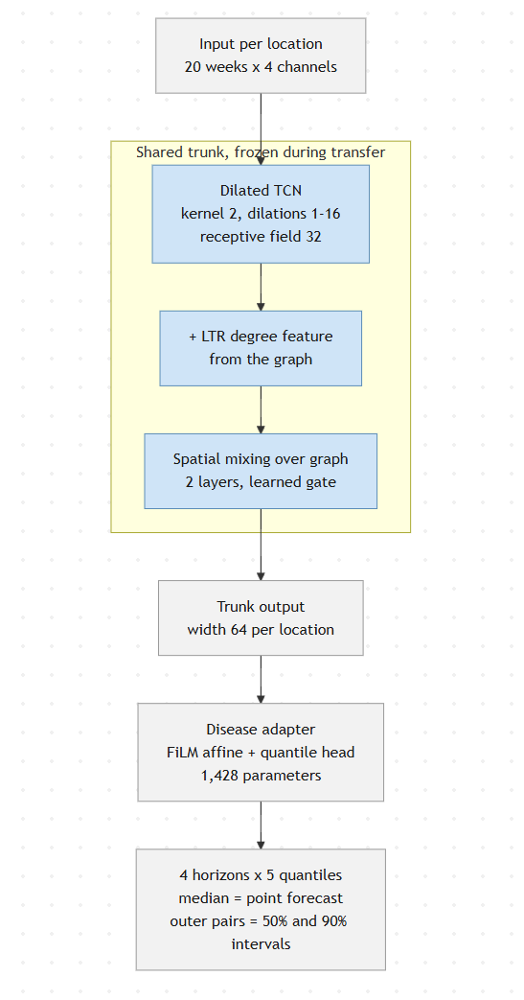
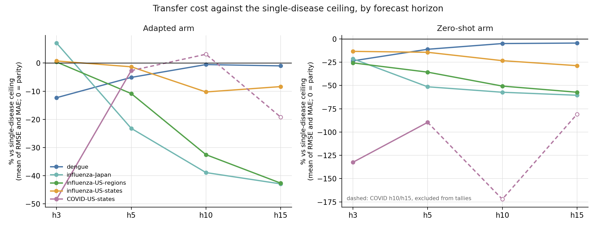
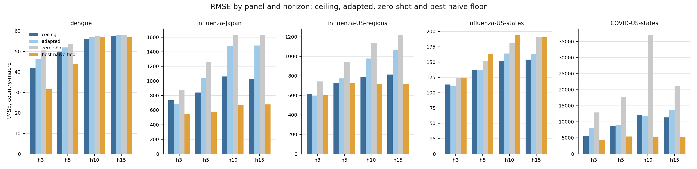
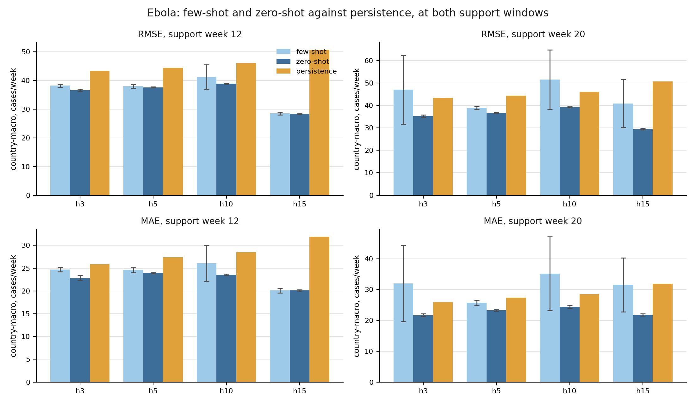
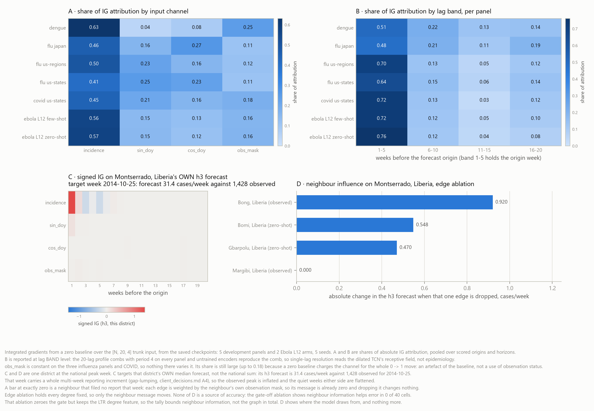

# Milestone 4: Transferable Representations, Meta-Learning and Few-Shot Adaptation

## 1. Purpose and scope

Milestone 4 covers Week 4 of the project brief, whose objective is to add the core methodological contribution of the project: a model that learns from data-rich diseases and can then be pointed at a disease it has never seen. The brief names three deliverables — a second version of the framework carrying a transfer module, a set of leave-one-disease-out transfer results, and a few-shot adaptation protocol for an unseen disease — and separately marks meta-learning as required under goal G2. All four are complete, and all computation for this milestone is finished with nothing left queued. The work was carried out over five data panels: dengue, influenza-Japan, influenza-US-regions, influenza-US-states and COVID-US-states, with Ebola held out entirely as the unseen disease. Every experiment reported in the sections that follow was run at five random seeds (42, 52, 62, 72, 82) and evaluated at four forecast horizons of three, five, ten and fifteen weeks ahead. Results are aggregated by country-macro average, meaning each location is scored first, locations are averaged within a country, and countries are then averaged with equal weight, so that no single large country can determine a headline figure. Where a disease is described as held out, no data from that disease was used to train the shared model.

| Deliverable | State | Evidence |
|---|---|---|
| Framework v2 with transfer module | Delivered | `train/lodo.py`, five fold variants at five seeds |
| Leave-one-disease-out transfer results | Delivered | `LDO3_Results.md`, 215 of 215 expected artifacts verified present |
| Few-shot adaptation protocol for an unseen disease | Delivered | `train/ebola.py`, run under a frozen pre-registration at five seeds |
| Meta-learning (goal G2) | Delivered | `ANIL_Results.md`, four folds at five seeds per arm |

## 2. Framework v2: the transfer module

The framework is built in two parts, and the split between them is what makes transfer to a new disease possible. A shared trunk reads the recent history of every location and produces a compact description of that location's current state. A small per-disease adapter turns that description into a forecast. The trunk holds what the diseases have in common and the adapter holds what is specific to one disease, so a new disease requires a new adapter rather than a new model.

The trunk takes a fixed input per location: a window of 20 weeks carrying four channels, `incidence_norm`, `sin_doy`, `cos_doy` and `obs_mask`. Three components run over it. A dilated temporal convolutional network with kernel size 2 and dilations of 1, 2, 4, 8 and 16 gives a receptive field of 32 weeks, which covers the full 20-week window. An LTR degree feature computed from the graph is added to the temporal output, giving each location a representation of its own position in the graph. Two layers of spatial mixing then pass messages over the graph adjacency, held at two layers because three or more over-smooth. The mixing is controlled by a learned gate, which produces a value per location from a small multi-layer perceptron and returns `(1 - g) * h + g * h_spatial`, so each location decides for itself how much of the neighbourhood signal to take. The trunk width is 64 and dropout is 0.1.

The adapter is a FiLM affine and a quantile head: a learned per-feature scale and shift applied to the trunk output, then a single linear map to all four horizons at five quantile levels of 0.05, 0.25, 0.50, 0.75 and 0.95. That is 1,428 parameters. The median quantile is the point forecast scored for RMSE, MAE and PCC, and the outer pairs give the 50 per cent and 90 per cent prediction intervals, so one output carries both the forecast and its uncertainty. Training minimises pinball loss across the five quantiles.

Transfer follows from the split. The trunk and one adapter per available disease are trained together on the diseases in hand. The trunk is then frozen and a single fresh adapter is fitted on the new disease, so the new disease has to supply enough signal to fit 1,428 parameters rather than a whole model. A stricter route is also supported: the zero-shot arm takes the mean of the adapters already trained on the other diseases and applies it with nothing fitted at all, so the new disease contributes no training data whatsoever.

The adapter size was chosen against measurement. Three larger surfaces were tested against it on a frozen trunk, seed-paired at five seeds: MLP heads at 5,460 and 21,780 parameters and a FiLM-plus-MLP head at 5,588. In-domain, none of the 12 cells beat the affine adapter and one was worse. Across diseases the larger surfaces won 7 of 36 cells and lost 3, with the gains at the longest horizons and the losses at the shortest, reaching -22.5 per cent at h3 on influenza-Japan. The affine adapter was retained: the extra capacity does not pay, and it is the only surface small enough to fit from the tens of observations an emerging disease provides.

The trunk is disease-agnostic architecturally and in code. No disease name or disease identifier is among its inputs, and no internal dimension is sized by the number of locations, so the same trunk accepts a 10-location graph and a 7,165-location graph unchanged. The code enforces this at runtime: the trunk refuses any input that is not exactly four channels, and an audit routine lists every parameter whose shape matches one of the five graph sizes in use, with an empty list as the passing result. A change that broke the property would stop the model rather than pass unnoticed.

## 3. Leave-one-disease-out: the evaluation design

Transfer was tested by removing one disease from training entirely and then asking the model to forecast it. Three folds were run, one per held-out disease, at five seeds each. In every fold the trunk is trained on the remaining diseases, the held-out disease is never seen during trunk training, and the trunk is then frozen before anything is fitted on the held-out disease.

| Trunk trained on | Held out | Adapter fitted on |
|---|---|---|
| influenza, COVID | dengue | the held-out disease's own training fold, trunk frozen |
| dengue, COVID | influenza-Japan, influenza-US-regions, influenza-US-states | the held-out disease's own training fold, trunk frozen |
| dengue, influenza | COVID-US-states | the held-out disease's own training fold, trunk frozen |

The three influenza panels share a single adapter wherever they appear, in training and when held out, so the trunk cannot quietly absorb the differences between them into three separate heads. A held-out influenza fold therefore produces three separate results, one per panel, and they are never pooled into one influenza figure.

Two arms are scored in every fold. The **adapted** arm freezes the trunk and fits one fresh adapter on the held-out disease's own training fold. The **zero-shot** arm applies the mean of the adapters trained on the other diseases with nothing fitted on the held-out disease at all. The adapted arm is deliberately the optimistic case: the held-out disease is handed its entire training fold to fit the adapter, which is far more data than an emerging disease would ever have. If transfer fails under those conditions, it cannot succeed on the tens of observations available at the start of an outbreak, so the adapted arm sets an upper bound on what few-shot transfer can deliver.

Every result is read against two references. The first is the **single-disease ceiling**: the same architecture trained on the held-out disease itself, from scratch, with no transfer. It is paired seed to seed, so the transfer run at seed 42 is compared against the single-disease run at seed 42 and the five paired differences form the interval. This makes the question precise, namely how much accuracy is lost by transferring rather than training on the disease directly. The second is the set of **naive floors**, three reference forecasts that require no model at all: persistence carries the last observed value forward, seasonal uses the value from the same week one season earlier and falls back to persistence where that week is unobserved, and train-mean predicts each location's average over its training period. Beating a naive floor is the minimum bar for a forecast being useful; approaching the ceiling is the bar for transfer being worthwhile.

The COVID panel's validation fold contains the Omicron peak and its test fold is a flat, low-amplitude tail on the far side of that break. COVID's h10 and h15 cells measure the fold boundary rather than transfer, and are reported in full but excluded from the tallies in either direction.

## 4. Leave-one-disease-out: results

### 4.1 How a cell is judged

A cell is one dataset at one horizon on one metric. The transfer arm is compared against the single-disease ceiling on the same dataset, paired seed to seed, and a cell counts as a result only when its interval excludes zero; otherwise it is reported as within noise. Thirty-six RMSE and MAE cells are attributable, being five panels at four horizons on two metrics, less the four COVID cells at h10 and h15 that measure the fold boundary. Two tests are applied to those cells. A small-sample t interval over the five seeds asks whether the difference survives seed variation, and a paired bootstrap over time origins, resampled ten thousand times with both arms rebuilt from the same origins, asks whether it survives origin variation. Both are reported.

Every single-disease ceiling in this section is the `encoder` arm. The results file for each panel holds a second arm alongside it, `encoder_mc`, under identical keys, and the two are different experiments. The quantile head predicts the log-space median, which inverts to the count-space median. That is the right point estimate for MAE, but RMSE is minimised by the count-space mean, so the point forecast sits systematically low for the metric it is scored by. `encoder_mc` corrects this by fitting one scalar offset per horizon on the validation fold alone and applying it to the point forecast. Averaged over the five seeds it helps at the short horizons on dengue, influenza-Japan and influenza-US-regions, improving RMSE by 9.3 per cent and MAE by 7.2 per cent at h3 on influenza-Japan and by 6.4 and 2.7 per cent on dengue. It costs elsewhere: on influenza-US-states it is worse on MAE at every horizon, by 12.4 per cent at h10, and on COVID it is worse on both metrics at every horizon, by 8.8, 21.4, 47.3 and 27.4 per cent on RMSE. The correction is fitted on the validation fold, so where validation and test differ in scale it transfers badly, and COVID is that case. `encoder` is therefore the arm reported throughout: it is the calibrated forecast, it is the arm every transfer comparison in this milestone was produced against, and its bias direction understates the model's own performance, so leaving it uncorrected cannot inflate any result. Both arms are kept in the records so the size of the gap stays visible.

### 4.2 The headline

Cross-disease transfer is negative. Judged by the paired bootstrap over time origins, 25 of the 36 attributable cells are significantly worse than the single-disease ceiling, 10 are within noise and 1 is better. Under the seed-paired t interval the same cells give 0 better, 18 within noise and 18 worse. Neither test finds a systematic advantage for transfer, and both find substantial losses.

The effect is ordered by horizon, which is the more useful finding. At h3 the transfer arm is close to parity with a model trained on the disease itself and most cells sit within noise. By h10 and h15 it is uniformly and substantially worse, reaching -38 per cent on influenza-Japan RMSE and -51 per cent on influenza-US-regions MAE. A frozen foreign trunk carries enough short-range structure to match in-domain training for a few weeks ahead and then loses it. The gradient is driven by dengue and influenza and does not depend on the excluded COVID cells.

### 4.3 Transfer verdict by cell

Counting only RMSE and MAE, against the seed-paired ceiling. The final column is the one that decides whether a cell is a result at all: it counts the horizons at which the adapted arm beats the best naive floor. Beating the ceiling while losing to a train-mean baseline is not transfer, it is two models failing together.

| Fold | Dataset | Metric | Better than ceiling | Within noise | Worse than ceiling | Excluded | Beats naive floor |
|---|---|---|---|---|---|---|---|
| dengue | dengue | rmse | 0 | 3 | 1 | 0 | 0/4 |
| dengue | dengue | mae | 0 | 3 | 1 | 0 | 2/4 |
| influenza | influenza_japan | rmse | 0 | 1 | 3 | 0 | 0/4 |
| influenza | influenza_japan | mae | 0 | 1 | 3 | 0 | 0/4 |
| influenza | influenza_us-regions | rmse | 0 | 2 | 2 | 0 | 0/4 |
| influenza | influenza_us-regions | mae | 0 | 2 | 2 | 0 | 0/4 |
| influenza | influenza_us-states | rmse | 0 | 2 | 2 | 0 | 4/4 |
| influenza | influenza_us-states | mae | 0 | 2 | 2 | 0 | 4/4 |
| covid | covid_us-states | rmse | 0 | 1 | 1 | 2 | 0/2 |
| covid | covid_us-states | mae | 0 | 1 | 1 | 2 | 0/2 |
| **total** | | | **0** | **18** | **18** | **4** | **10/36** |

Ten of 36 cells beat their naive floor, and all ten sit on influenza-US-states, which clears its floor at every horizon on both metrics, plus dengue MAE at two horizons. Dengue RMSE, influenza-Japan and influenza-US-regions do not beat their floors at any horizon.

### 4.4 Results by panel

Every metric is reported in count space at the country-macro aggregation. Positive means the transfer arm is better than the reference.

#### Held out: dengue

| h | Metric | Single (ceiling) | LDO3 adapted | LDO3 zero-shot | Best naive floor | Adapted vs ceiling | Zero-shot vs ceiling | Adapted vs floor |
|---|---|---|---|---|---|---|---|---|
| 3 | rmse | 42.06 ± 6.039 (5) | 46.40 ± 2.761 (5) | 50.50 ± 0.5277 (5) | 31.53 (persistence) | within noise (-11.9 ± 18.5%, n=5) | **-22.0%** ± 21.3 (n=5) | **-47.1%** ± 10.9 (n=5) |
| 5 | rmse | 49.94 ± 6.045 (5) | 51.99 ± 1.454 (5) | 53.70 ± 1.044 (5) | 43.82 (persistence) | within noise (-5.2 ± 13.9%, n=5) | within noise (-8.8 ± 17.1%, n=5) | **-18.6%** ± 4.1 (n=5) |
| 10 | rmse | 56.21 ± 0.6193 (5) | 56.93 ± 0.3388 (5) | 57.52 ± 0.5480 (5) | 57.02 (train_mean) | within noise (-1.3 ± 1.8%, n=5) | **-2.3%** ± 1.4 (n=5) | within noise (+0.2 ± 0.7%, n=5) |
| 15 | rmse | 57.38 ± 0.2147 (5) | 58.11 ± 0.1045 (5) | 58.21 ± 0.4868 (5) | 56.97 (train_mean) | **-1.3%** ± 0.5 (n=5) | **-1.4%** ± 1.1 (n=5) | **-2.0%** ± 0.2 (n=5) |
| 3 | mae | 18.37 ± 1.211 (5) | 20.65 ± 1.176 (5) | 22.89 ± 0.2485 (5) | 14.84 (persistence) | **-12.7%** ± 9.2 (n=5) | **-25.1%** ± 10.9 (n=5) | **-39.2%** ± 9.8 (n=5) |
| 5 | mae | 22.37 ± 1.490 (5) | 23.44 ± 0.7083 (5) | 25.28 ± 0.5478 (5) | 20.61 (persistence) | within noise (-5.0 ± 6.9%, n=5) | **-13.4%** ± 10.8 (n=5) | **-13.7%** ± 4.3 (n=5) |
| 10 | mae | 26.61 ± 0.3224 (5) | 26.55 ± 0.2882 (5) | 28.64 ± 0.4750 (5) | 30.51 (train_mean) | within noise (+0.2 ± 1.6%, n=5) | **-7.6%** ± 2.8 (n=5) | **+13.0%** ± 1.2 (n=5) |
| 15 | mae | 27.47 ± 0.2067 (5) | 27.67 ± 0.1269 (5) | 29.53 ± 0.6741 (5) | 30.46 (train_mean) | within noise (-0.7 ± 1.0%, n=5) | **-7.5%** ± 3.6 (n=5) | **+9.2%** ± 0.5 (n=5) |
| 3 | nrmse | 1.802 ± 0.0351 (5) | 1.839 ± 0.0587 (5) | 2.186 ± 0.0623 (5) | — | **-2.0%** ± 1.9 (n=5) | **-21.3%** ± 2.8 (n=5) | — |
| 5 | nrmse | 1.912 ± 0.0344 (5) | 1.999 ± 0.0433 (5) | 2.545 ± 0.1160 (5) | — | **-4.6%** ± 3.7 (n=5) | **-33.1%** ± 7.3 (n=5) | — |
| 10 | nrmse | 2.099 ± 0.0758 (5) | 2.076 ± 0.0245 (5) | 3.105 ± 0.2104 (5) | — | within noise (+1.0 ± 4.6%, n=5) | **-48.0%** ± 11.5 (n=5) | — |
| 15 | nrmse | 2.081 ± 0.0288 (5) | 2.084 ± 0.0124 (5) | 3.238 ± 0.2068 (5) | — | within noise (-0.1 ± 2.1%, n=5) | **-55.5%** ± 9.9 (n=5) | — |
| 3 | pcc | 0.4219 ± 0.0037 (5) | 0.4107 ± 0.0134 (5) | 0.3937 ± 0.0084 (5) | 0.4580 (persistence) | within noise (-0.0 ± 0.0 pts, n=5) | **-0.0 pts** ± 0.0 (n=5) | **-10.3%** ± 3.6 (n=5) |
| 5 | pcc | 0.3354 ± 0.0088 (5) | 0.2865 ± 0.0281 (5) | 0.2586 ± 0.0097 (5) | 0.3123 (persistence) | **-0.0 pts** ± 0.0 (n=5) | **-0.1 pts** ± 0.0 (n=5) | within noise (-8.3 ± 11.2%, n=5) |
| 10 | pcc | 0.1965 ± 0.0112 (5) | 0.1391 ± 0.0255 (5) | 0.0700 ± 0.0170 (5) | 0.1286 (persistence) | **-0.1 pts** ± 0.0 (n=5) | **-0.1 pts** ± 0.0 (n=5) | within noise (+8.2 ± 24.7%, n=5) |
| 15 | pcc | 0.1061 ± 0.0135 (5) | 0.0808 ± 0.0241 (5) | 0.0509 ± 0.0162 (5) | 0.0338 (seasonal) | within noise (-0.0 ± 0.0 pts, n=5) | **-0.1 pts** ± 0.0 (n=5) | **+139.4%** ± 88.8 (n=5) |
| 3 | smape | 95.14 ± 0.9048 (5) | 97.42 ± 1.796 (5) | 101.2 ± 0.5659 (5) | 104.9 (persistence) | **-2.4%** ± 2.4 (n=5) | **-6.4%** ± 1.4 (n=5) | **+7.2%** ± 2.1 (n=5) |
| 5 | smape | 103.1 ± 0.8599 (5) | 104.7 ± 1.471 (5) | 108.7 ± 1.414 (5) | 117.4 (train_mean) | within noise (-1.5 ± 2.4%, n=5) | **-5.5%** ± 1.9 (n=5) | **+10.8%** ± 1.6 (n=5) |
| 10 | smape | 116.6 ± 0.8001 (5) | 116.6 ± 1.118 (5) | 119.3 ± 1.096 (5) | 117.3 (train_mean) | within noise (-0.0 ± 2.0%, n=5) | **-2.3%** ± 1.0 (n=5) | within noise (+0.6 ± 1.2%, n=5) |
| 15 | smape | 123.3 ± 1.217 (5) | 124.7 ± 0.8151 (5) | 122.8 ± 1.003 (5) | 117.3 (train_mean) | within noise (-1.1 ± 1.9%, n=5) | within noise (+0.5 ± 1.6%, n=5) | **-6.3%** ± 0.9 (n=5) |
| 3 | peak_intensity | 174.4 ± 50.87 (5) | 194.9 ± 25.31 (5) | 231.4 ± 3.179 (5) | 0.4760 (persistence) | within noise (-17.1 ± 31.7%, n=5) | within noise (-41.5 ± 47.0%, n=5) | **-40854.9%** ± 6601.3 (n=5) |
| 5 | peak_intensity | 198.0 ± 56.57 (5) | 228.6 ± 9.769 (5) | 241.6 ± 5.295 (5) | 0.8410 (persistence) | within noise (-22.0 ± 35.8%, n=5) | within noise (-30.0 ± 43.5%, n=5) | **-27085.1%** ± 1442.1 (n=5) |
| 10 | peak_intensity | 198.6 ± 17.06 (5) | 256.0 ± 2.730 (5) | 248.7 ± 2.844 (5) | 8.363 (persistence) | **-29.7%** ± 14.6 (n=5) | **-26.0%** ± 14.6 (n=5) | **-2960.7%** ± 40.5 (n=5) |
| 15 | peak_intensity | 229.4 ± 14.40 (5) | 264.0 ± 0.5263 (5) | 245.2 ± 4.078 (5) | 17.24 (persistence) | **-15.5%** ± 9.5 (n=5) | within noise (-7.3 ± 10.7%, n=5) | **-1431.0%** ± 3.8 (n=5) |
| 3 | peak_timing | 10.91 ± 0.8371 (5) | 13.92 ± 1.469 (5) | 13.49 ± 0.7019 (5) | 3.598 (persistence) | **-28.7%** ± 26.1 (n=5) | **-24.4%** ± 17.4 (n=5) | **-286.8%** ± 50.7 (n=5) |
| 5 | peak_timing | 18.35 ± 3.186 (5) | 16.21 ± 1.488 (5) | 18.78 ± 1.002 (5) | 5.159 (persistence) | within noise (+10.6 ± 12.4%, n=5) | within noise (-5.0 ± 24.4%, n=5) | **-214.1%** ± 35.8 (n=5) |
| 10 | peak_timing | 28.66 ± 3.043 (5) | 22.06 ± 1.643 (5) | 31.93 ± 1.563 (5) | 12.81 (persistence) | **+22.0%** ± 15.8 (n=5) | within noise (-12.4 ± 16.3%, n=5) | **-72.3%** ± 15.9 (n=5) |
| 15 | peak_timing | 31.98 ± 1.134 (5) | 31.07 ± 4.027 (5) | 35.18 ± 2.159 (5) | 22.21 (persistence) | within noise (+3.0 ± 13.0%, n=5) | **-10.1%** ± 7.9 (n=5) | **-39.9%** ± 22.5 (n=5) |

#### Held out: influenza-Japan

| h | Metric | Single (ceiling) | LDO3 adapted | LDO3 zero-shot | Best naive floor | Adapted vs ceiling | Zero-shot vs ceiling | Adapted vs floor |
|---|---|---|---|---|---|---|---|---|
| 3 | rmse | 734.9 ± 58.53 (5) | 682.7 ± 74.21 (5) | 879.2 ± 97.37 (5) | 547.0 (seasonal) | within noise (+6.4 ± 18.6%, n=5) | **-19.9%** ± 15.5 (n=5) | **-24.8%** ± 16.8 (n=5) |
| 5 | rmse | 841.1 ± 35.42 (5) | 1,037 ± 81.26 (5) | 1,256 ± 80.79 (5) | 579.8 (seasonal) | **-23.3%** ± 12.5 (n=5) | **-49.5%** ± 12.5 (n=5) | **-78.8%** ± 17.4 (n=5) |
| 10 | rmse | 1,063 ± 74.93 (5) | 1,481 ± 30.20 (5) | 1,634 ± 5.363 (5) | 673.7 (seasonal) | **-39.9%** ± 12.4 (n=5) | **-54.3%** ± 12.2 (n=5) | **-119.9%** ± 5.6 (n=5) |
| 15 | rmse | 1,031 ± 121.0 (5) | 1,486 ± 28.22 (5) | 1,632 ± 4.565 (5) | 679.5 (seasonal) | **-45.7%** ± 21.4 (n=5) | **-59.9%** ± 23.0 (n=5) | **-118.8%** ± 5.2 (n=5) |
| 3 | mae | 261.5 ± 22.75 (5) | 238.7 ± 23.04 (5) | 320.3 ± 34.78 (5) | 238.0 (seasonal) | within noise (+7.8 ± 18.7%, n=5) | **-22.9%** ± 16.1 (n=5) | within noise (-0.3 ± 12.0%, n=5) |
| 5 | mae | 323.5 ± 10.45 (5) | 397.9 ± 31.28 (5) | 496.2 ± 39.80 (5) | 257.8 (seasonal) | **-23.0%** ± 11.5 (n=5) | **-53.3%** ± 12.0 (n=5) | **-54.4%** ± 15.1 (n=5) |
| 10 | mae | 445.0 ± 28.83 (5) | 611.8 ± 18.12 (5) | 711.6 ± 12.04 (5) | 319.6 (seasonal) | **-37.9%** ± 11.3 (n=5) | **-60.3%** ± 9.2 (n=5) | **-91.4%** ± 7.0 (n=5) |
| 15 | mae | 443.8 ± 43.63 (5) | 617.5 ± 14.14 (5) | 709.6 ± 5.068 (5) | 334.3 (seasonal) | **-40.1%** ± 16.5 (n=5) | **-61.1%** ± 18.7 (n=5) | **-84.7%** ± 5.3 (n=5) |
| 3 | nrmse | 1.273 ± 0.1201 (5) | 1.161 ± 0.1458 (5) | 1.553 ± 0.1864 (5) | — | within noise (+7.8 ± 20.5%, n=5) | **-22.4%** ± 16.1 (n=5) | — |
| 5 | nrmse | 1.261 ± 0.0426 (5) | 1.542 ± 0.1205 (5) | 1.940 ± 0.1305 (5) | — | **-22.4%** ± 12.6 (n=5) | **-53.8%** ± 11.6 (n=5) | — |
| 10 | nrmse | 1.333 ± 0.0819 (5) | 1.899 ± 0.0491 (5) | 2.121 ± 0.0068 (5) | — | **-42.9%** ± 12.2 (n=5) | **-59.6%** ± 11.1 (n=5) | — |
| 15 | nrmse | 1.303 ± 0.1501 (5) | 1.952 ± 0.0277 (5) | 2.168 ± 0.0065 (5) | — | **-51.4%** ± 22.0 (n=5) | **-68.1%** ± 23.9 (n=5) | — |
| 3 | pcc | 0.8723 ± 0.0397 (5) | 0.9032 ± 0.0096 (5) | 0.8088 ± 0.0828 (5) | 0.9107 (seasonal) | within noise (+0.0 ± 0.1 pts, n=5) | within noise (-0.1 ± 0.1 pts, n=5) | within noise (-0.8 ± 1.3%, n=5) |
| 5 | pcc | 0.8987 ± 0.0221 (5) | 0.8526 ± 0.0305 (5) | 0.5946 ± 0.1207 (5) | 0.9129 (seasonal) | within noise (-0.0 ± 0.0 pts, n=5) | **-0.3 pts** ± 0.2 (n=5) | **-6.6%** ± 4.2 (n=5) |
| 10 | pcc | 0.8439 ± 0.0060 (5) | 0.6604 ± 0.0427 (5) | 0.1558 ± 0.0741 (5) | 0.8791 (seasonal) | **-0.2 pts** ± 0.1 (n=5) | **-0.7 pts** ± 0.1 (n=5) | **-24.9%** ± 6.0 (n=5) |
| 15 | pcc | 0.8369 ± 0.0204 (5) | 0.5938 ± 0.0764 (5) | 0.0149 ± 0.1067 (5) | 0.8695 (seasonal) | **-0.2 pts** ± 0.1 (n=5) | **-0.8 pts** ± 0.1 (n=5) | **-31.7%** ± 10.9 (n=5) |
| 3 | smape | 91.99 ± 2.502 (5) | 82.62 ± 2.357 (5) | 88.65 ± 3.598 (5) | 95.22 (seasonal) | **+10.2%** ± 2.2 (n=5) | within noise (+3.6 ± 6.2%, n=5) | **+13.2%** ± 3.1 (n=5) |
| 5 | smape | 97.13 ± 1.550 (5) | 94.51 ± 3.527 (5) | 102.5 ± 4.393 (5) | 93.73 (seasonal) | within noise (+2.6 ± 6.0%, n=5) | within noise (-5.6 ± 7.1%, n=5) | within noise (-0.8 ± 4.7%, n=5) |
| 10 | smape | 106.5 ± 2.203 (5) | 107.5 ± 4.677 (5) | 124.1 ± 1.347 (5) | 91.50 (seasonal) | within noise (-0.9 ± 4.3%, n=5) | **-16.5%** ± 2.7 (n=5) | **-17.5%** ± 6.3 (n=5) |
| 15 | smape | 103.6 ± 3.415 (5) | 110.9 ± 2.476 (5) | 129.7 ± 1.249 (5) | 91.22 (seasonal) | **-7.0%** ± 2.6 (n=5) | **-25.3%** ± 4.8 (n=5) | **-21.5%** ± 3.4 (n=5) |
| 3 | peak_intensity | 2,717 ± 531.8 (5) | 2,630 ± 631.2 (5) | 3,135 ± 812.4 (5) | 10.02 (persistence) | within noise (+0.5 ± 36.2%, n=5) | within noise (-22.8 ± 65.3%, n=5) | **-26140.7%** ± 7819.2 (n=5) |
| 5 | peak_intensity | 2,885 ± 447.5 (5) | 3,925 ± 589.2 (5) | 4,400 ± 800.7 (5) | 259.0 (persistence) | **-37.5%** ± 29.3 (n=5) | **-56.3%** ± 51.0 (n=5) | **-1415.3%** ± 282.4 (n=5) |
| 10 | peak_intensity | 3,447 ± 620.5 (5) | 5,503 ± 318.5 (5) | 5,983 ± 308.7 (5) | 661.6 (persistence) | **-64.3%** ± 40.4 (n=5) | **-78.6%** ± 44.7 (n=5) | **-731.8%** ± 59.8 (n=5) |
| 15 | peak_intensity | 3,471 ± 758.9 (5) | 5,609 ± 191.5 (5) | 6,423 ± 164.5 (5) | 661.6 (persistence) | **-67.9%** ± 46.3 (n=5) | **-91.7%** ± 48.3 (n=5) | **-747.9%** ± 35.9 (n=5) |
| 3 | peak_timing | 4.868 ± 1.271 (5) | 2.872 ± 0.3216 (5) | 3.409 ± 0.4614 (5) | 3.936 (persistence) | **+36.6%** ± 27.7 (n=5) | **+26.2%** ± 24.6 (n=5) | **+27.0%** ± 10.1 (n=5) |
| 5 | peak_timing | 24.66 ± 2.490 (5) | 20.03 ± 0.9385 (5) | 19.87 ± 0.6649 (5) | 19.66 (persistence) | **+18.0%** ± 13.4 (n=5) | **+18.6%** ± 13.5 (n=5) | within noise (-1.9 ± 5.9%, n=5) |
| 10 | peak_timing | 26.30 ± 1.379 (5) | 25.29 ± 3.577 (5) | 39.78 ± 2.939 (5) | 24.91 (seasonal) | within noise (+3.8 ± 16.8%, n=5) | **-52.0%** ± 22.9 (n=5) | within noise (-1.5 ± 17.8%, n=5) |
| 15 | peak_timing | 26.74 ± 1.893 (5) | 24.29 ± 3.944 (5) | 50.67 ± 3.276 (5) | 24.91 (seasonal) | within noise (+9.4 ± 14.1%, n=5) | **-90.5%** ± 26.4 (n=5) | within noise (+2.5 ± 19.7%, n=5) |

#### Held out: influenza-US-regions

| h | Metric | Single (ceiling) | LDO3 adapted | LDO3 zero-shot | Best naive floor | Adapted vs ceiling | Zero-shot vs ceiling | Adapted vs floor |
|---|---|---|---|---|---|---|---|---|
| 3 | rmse | 613.2 ± 82.33 (5) | 592.1 ± 26.55 (5) | 743.1 ± 28.08 (5) | 599.6 (persistence) | within noise (+1.7 ± 20.7%, n=5) | within noise (-23.2 ± 24.3%, n=5) | within noise (+1.2 ± 5.5%, n=5) |
| 5 | rmse | 728.2 ± 76.32 (5) | 774.3 ± 41.07 (5) | 939.0 ± 48.79 (5) | 728.7 (seasonal) | within noise (-7.6 ± 19.6%, n=5) | **-30.5%** ± 24.2 (n=5) | within noise (-6.3 ± 7.0%, n=5) |
| 10 | rmse | 787.8 ± 40.54 (5) | 977.3 ± 75.03 (5) | 1,136 ± 37.11 (5) | 721.4 (seasonal) | **-24.6%** ± 18.5 (n=5) | **-44.5%** ± 10.4 (n=5) | **-35.5%** ± 12.9 (n=5) |
| 15 | rmse | 812.8 ± 68.06 (5) | 1,067 ± 57.98 (5) | 1,222 ± 28.62 (5) | 715.4 (seasonal) | **-32.4%** ± 22.0 (n=5) | **-51.1%** ± 15.2 (n=5) | **-49.1%** ± 10.1 (n=5) |
| 3 | mae | 374.1 ± 56.77 (5) | 371.0 ± 25.15 (5) | 470.4 ± 27.56 (5) | 376.8 (persistence) | within noise (-1.0 ± 20.9%, n=5) | **-28.3%** ± 27.7 (n=5) | within noise (+1.5 ± 8.3%, n=5) |
| 5 | mae | 451.3 ± 67.70 (5) | 505.3 ± 30.88 (5) | 621.2 ± 34.03 (5) | 427.1 (seasonal) | within noise (-14.1 ± 24.9%, n=5) | **-40.8%** ± 34.2 (n=5) | **-18.3%** ± 9.0 (n=5) |
| 10 | mae | 512.4 ± 40.62 (5) | 714.0 ± 63.83 (5) | 799.3 ± 25.87 (5) | 421.6 (seasonal) | **-40.5%** ± 26.0 (n=5) | **-56.9%** ± 18.8 (n=5) | **-69.3%** ± 18.8 (n=5) |
| 15 | mae | 542.3 ± 54.15 (5) | 820.4 ± 46.30 (5) | 879.8 ± 21.73 (5) | 417.7 (seasonal) | **-52.9%** ± 27.0 (n=5) | **-63.4%** ± 19.2 (n=5) | **-96.4%** ± 13.8 (n=5) |
| 3 | nrmse | 0.4730 ± 0.0349 (5) | 0.4483 ± 0.0133 (5) | 0.5553 ± 0.0171 (5) | — | within noise (+4.7 ± 10.8%, n=5) | **-18.1%** ± 14.8 (n=5) | — |
| 5 | nrmse | 0.5609 ± 0.0425 (5) | 0.5846 ± 0.0206 (5) | 0.7066 ± 0.0329 (5) | — | within noise (-4.8 ± 12.6%, n=5) | **-26.8%** ± 18.2 (n=5) | — |
| 10 | nrmse | 0.6305 ± 0.0302 (5) | 0.7234 ± 0.0481 (5) | 0.8646 ± 0.0245 (5) | — | **-15.1%** ± 13.8 (n=5) | **-37.3%** ± 6.0 (n=5) | — |
| 15 | nrmse | 0.6625 ± 0.0498 (5) | 0.7937 ± 0.0500 (5) | 0.9425 ± 0.0211 (5) | — | **-20.5%** ± 17.5 (n=5) | **-42.9%** ± 13.1 (n=5) | — |
| 3 | pcc | 0.8241 ± 0.0317 (5) | 0.8511 ± 0.0109 (5) | 0.8114 ± 0.0274 (5) | 0.7938 (persistence) | within noise (+0.0 ± 0.0 pts, n=5) | within noise (-0.0 ± 0.1 pts, n=5) | **+7.2%** ± 1.7 (n=5) |
| 5 | pcc | 0.7431 ± 0.0438 (5) | 0.7604 ± 0.0184 (5) | 0.7046 ± 0.0292 (5) | 0.7069 (seasonal) | within noise (+0.0 ± 0.1 pts, n=5) | within noise (-0.0 ± 0.1 pts, n=5) | **+7.6%** ± 3.2 (n=5) |
| 10 | pcc | 0.7017 ± 0.0592 (5) | 0.7319 ± 0.0251 (5) | 0.5845 ± 0.0528 (5) | 0.7108 (seasonal) | within noise (+0.0 ± 0.1 pts, n=5) | **-0.1 pts** ± 0.1 (n=5) | within noise (+3.0 ± 4.4%, n=5) |
| 15 | pcc | 0.6622 ± 0.1102 (5) | 0.7404 ± 0.0402 (5) | 0.5007 ± 0.0549 (5) | 0.7078 (seasonal) | within noise (+0.1 ± 0.2 pts, n=5) | within noise (-0.2 ± 0.2 pts, n=5) | within noise (+4.6 ± 7.0%, n=5) |
| 3 | smape | 27.94 ± 2.708 (5) | 30.35 ± 3.128 (5) | 37.03 ± 2.318 (5) | 29.89 (persistence) | within noise (-8.8 ± 9.4%, n=5) | **-33.7%** ± 20.4 (n=5) | within noise (-1.5 ± 13.0%, n=5) |
| 5 | smape | 33.43 ± 4.959 (5) | 42.12 ± 3.833 (5) | 49.92 ± 2.908 (5) | 31.55 (seasonal) | **-27.1%** ± 15.1 (n=5) | **-52.7%** ± 37.2 (n=5) | **-33.5%** ± 15.1 (n=5) |
| 10 | smape | 40.24 ± 2.425 (5) | 69.53 ± 7.170 (5) | 68.79 ± 2.611 (5) | 31.65 (seasonal) | **-73.3%** ± 25.5 (n=5) | **-71.5%** ± 17.0 (n=5) | **-119.7%** ± 28.1 (n=5) |
| 15 | smape | 44.73 ± 3.004 (5) | 86.25 ± 6.391 (5) | 78.55 ± 2.656 (5) | 31.69 (seasonal) | **-93.8%** ± 28.0 (n=5) | **-76.0%** ± 10.6 (n=5) | **-172.1%** ± 25.0 (n=5) |
| 3 | peak_intensity | 2,132 ± 448.2 (5) | 1,902 ± 230.6 (5) | 2,527 ± 201.4 (5) | 0.0000 (persistence) | within noise (+6.7 ± 33.4%, n=5) | within noise (-23.4 ± 39.8%, n=5) | — |
| 5 | peak_intensity | 2,535 ± 373.7 (5) | 2,702 ± 358.4 (5) | 3,328 ± 275.8 (5) | 0.0000 (persistence) | within noise (-8.9 ± 29.6%, n=5) | **-34.4%** ± 34.1 (n=5) | — |
| 10 | peak_intensity | 2,712 ± 630.8 (5) | 3,308 ± 404.5 (5) | 4,083 ± 157.4 (5) | 7.400 (persistence) | within noise (-26.3 ± 36.1%, n=5) | **-57.1%** ± 45.2 (n=5) | **-44600.1%** ± 6786.2 (n=5) |
| 15 | peak_intensity | 2,766 ± 637.1 (5) | 3,320 ± 401.8 (5) | 4,407 ± 114.9 (5) | 167.0 (persistence) | within noise (-23.8 ± 30.0%, n=5) | **-65.6%** ± 42.6 (n=5) | **-1888.3%** ± 298.7 (n=5) |
| 3 | peak_timing | 43.28 ± 13.91 (5) | 39.80 ± 0.1225 (5) | 33.00 ± 23.42 (5) | 3.000 (persistence) | within noise (-1.8 ± 49.6%, n=5) | within noise (+2.8 ± 127.0%, n=5) | **-1226.7%** ± 5.1 (n=5) |
| 5 | peak_timing | 55.04 ± 18.59 (5) | 56.28 ± 16.79 (5) | 46.36 ± 11.28 (5) | 5.000 (persistence) | within noise (-26.3 ± 125.9%, n=5) | within noise (+7.2 ± 48.1%, n=5) | **-1025.6%** ± 417.0 (n=5) |
| 10 | peak_timing | 67.36 ± 10.43 (5) | 81.20 ± 17.71 (5) | 74.56 ± 9.203 (5) | 12.50 (persistence) | within noise (-22.9 ± 39.8%, n=5) | within noise (-12.9 ± 28.4%, n=5) | **-549.6%** ± 175.9 (n=5) |
| 15 | peak_timing | 67.76 ± 9.164 (5) | 73.68 ± 23.99 (5) | 79.56 ± 15.79 (5) | 42.40 (persistence) | within noise (-13.6 ± 59.5%, n=5) | within noise (-18.6 ± 32.5%, n=5) | **-73.8%** ± 70.3 (n=5) |

#### Held out: influenza-US-states

| h | Metric | Single (ceiling) | LDO3 adapted | LDO3 zero-shot | Best naive floor | Adapted vs ceiling | Zero-shot vs ceiling | Adapted vs floor |
|---|---|---|---|---|---|---|---|---|
| 3 | rmse | 113.4 ± 3.880 (5) | 110.9 ± 3.232 (5) | 124.4 ± 3.380 (5) | 124.0 (persistence) | within noise (+2.0 ± 7.4%, n=5) | **-9.8%** ± 7.5 (n=5) | **+10.6%** ± 3.2 (n=5) |
| 5 | rmse | 136.8 ± 4.307 (5) | 136.6 ± 3.825 (5) | 151.9 ± 4.305 (5) | 163.0 (persistence) | within noise (+0.0 ± 7.1%, n=5) | **-11.2%** ± 7.9 (n=5) | **+16.2%** ± 2.9 (n=5) |
| 10 | rmse | 151.5 ± 1.939 (5) | 164.0 ± 2.725 (5) | 180.7 ± 2.226 (5) | 194.7 (seasonal) | **-8.3%** ± 2.7 (n=5) | **-19.3%** ± 2.0 (n=5) | **+15.8%** ± 1.7 (n=5) |
| 15 | rmse | 154.1 ± 4.164 (5) | 163.2 ± 3.319 (5) | 191.6 ± 2.321 (5) | 190.5 (seasonal) | **-6.0%** ± 4.7 (n=5) | **-24.4%** ± 3.2 (n=5) | **+14.3%** ± 2.2 (n=5) |
| 3 | mae | 68.27 ± 1.757 (5) | 68.60 ± 1.679 (5) | 79.81 ± 1.938 (5) | 80.67 (persistence) | within noise (-0.6 ± 5.3%, n=5) | **-17.0%** ± 6.5 (n=5) | **+15.0%** ± 2.6 (n=5) |
| 5 | mae | 84.01 ± 2.051 (5) | 86.19 ± 2.321 (5) | 98.69 ± 1.632 (5) | 111.8 (persistence) | within noise (-2.7 ± 6.2%, n=5) | **-17.6%** ± 5.3 (n=5) | **+22.9%** ± 2.6 (n=5) |
| 10 | mae | 96.87 ± 1.370 (5) | 108.7 ± 2.336 (5) | 123.4 ± 1.240 (5) | 119.1 (seasonal) | **-12.2%** ± 3.6 (n=5) | **-27.4%** ± 2.0 (n=5) | **+8.8%** ± 2.4 (n=5) |
| 15 | mae | 100.3 ± 1.841 (5) | 111.0 ± 1.446 (5) | 133.4 ± 1.675 (5) | 115.4 (seasonal) | **-10.8%** ± 3.6 (n=5) | **-33.1%** ± 1.9 (n=5) | **+3.8%** ± 1.6 (n=5) |
| 3 | nrmse | 0.6235 ± 0.0139 (5) | 0.6607 ± 0.0159 (5) | 0.7014 ± 0.0160 (5) | — | **-6.1%** ± 6.0 (n=5) | **-12.6%** ± 5.6 (n=5) | — |
| 5 | nrmse | 0.7688 ± 0.0102 (5) | 0.8364 ± 0.0239 (5) | 0.8652 ± 0.0101 (5) | — | **-8.8%** ± 5.5 (n=5) | **-12.6%** ± 3.2 (n=5) | — |
| 10 | nrmse | 0.9499 ± 0.0461 (5) | 1.103 ± 0.0734 (5) | 1.050 ± 0.0160 (5) | — | **-16.5%** ± 14.3 (n=5) | **-10.8%** ± 7.6 (n=5) | — |
| 15 | nrmse | 1.029 ± 0.0308 (5) | 1.175 ± 0.0483 (5) | 1.145 ± 0.0112 (5) | — | **-14.3%** ± 5.2 (n=5) | **-11.4%** ± 3.3 (n=5) | — |
| 3 | pcc | 0.8077 ± 0.0120 (5) | 0.8038 ± 0.0101 (5) | 0.7664 ± 0.0297 (5) | 0.7209 (persistence) | within noise (-0.0 ± 0.0 pts, n=5) | **-0.0 pts** ± 0.0 (n=5) | **+11.5%** ± 1.7 (n=5) |
| 5 | pcc | 0.7066 ± 0.0147 (5) | 0.6980 ± 0.0226 (5) | 0.6423 ± 0.0266 (5) | 0.5329 (persistence) | within noise (-0.0 ± 0.0 pts, n=5) | **-0.1 pts** ± 0.0 (n=5) | **+31.0%** ± 5.3 (n=5) |
| 10 | pcc | 0.6413 ± 0.0103 (5) | 0.5921 ± 0.0224 (5) | 0.4547 ± 0.0323 (5) | 0.4476 (seasonal) | **-0.0 pts** ± 0.0 (n=5) | **-0.2 pts** ± 0.0 (n=5) | **+32.3%** ± 6.2 (n=5) |
| 15 | pcc | 0.6399 ± 0.0257 (5) | 0.6488 ± 0.0395 (5) | 0.4353 ± 0.0797 (5) | 0.4621 (seasonal) | within noise (+0.0 ± 0.1 pts, n=5) | **-0.2 pts** ± 0.1 (n=5) | **+40.4%** ± 10.6 (n=5) |
| 3 | smape | 43.43 ± 0.5293 (5) | 44.85 ± 0.4570 (5) | 51.17 ± 0.6090 (5) | 48.86 (persistence) | **-3.3%** ± 2.4 (n=5) | **-17.8%** ± 3.1 (n=5) | **+8.2%** ± 1.2 (n=5) |
| 5 | smape | 50.62 ± 0.5976 (5) | 52.97 ± 0.8326 (5) | 60.35 ± 0.6836 (5) | 63.27 (persistence) | **-4.7%** ± 3.5 (n=5) | **-19.2%** ± 1.7 (n=5) | **+16.3%** ± 1.6 (n=5) |
| 10 | smape | 59.64 ± 0.5257 (5) | 66.54 ± 0.9837 (5) | 74.05 ± 0.7744 (5) | 65.29 (seasonal) | **-11.6%** ± 1.5 (n=5) | **-24.2%** ± 1.7 (n=5) | **-1.9%** ± 1.9 (n=5) |
| 15 | smape | 63.87 ± 0.9246 (5) | 70.79 ± 0.6765 (5) | 80.14 ± 0.9790 (5) | 66.20 (seasonal) | **-10.9%** ± 2.7 (n=5) | **-25.5%** ± 1.6 (n=5) | **-6.9%** ± 1.3 (n=5) |
| 3 | peak_intensity | 408.7 ± 30.08 (5) | 344.7 ± 34.63 (5) | 341.8 ± 30.73 (5) | 0.0000 (persistence) | within noise (+14.8 ± 18.1%, n=5) | **+16.4%** ± 5.5 (n=5) | — |
| 5 | peak_intensity | 456.3 ± 18.00 (5) | 442.2 ± 17.13 (5) | 447.8 ± 42.48 (5) | 0.0000 (persistence) | within noise (+2.9 ± 7.9%, n=5) | within noise (+1.5 ± 16.0%, n=5) | — |
| 10 | peak_intensity | 481.9 ± 30.30 (5) | 484.2 ± 30.63 (5) | 576.7 ± 34.35 (5) | 0.0000 (persistence) | within noise (-0.7 ± 9.7%, n=5) | **-20.2%** ± 14.7 (n=5) | — |
| 15 | peak_intensity | 485.6 ± 25.41 (5) | 481.2 ± 20.98 (5) | 654.0 ± 24.13 (5) | 0.8776 (persistence) | within noise (+0.8 ± 5.9%, n=5) | **-35.0%** ± 12.4 (n=5) | **-54734.2%** ± 2968.3 (n=5) |
| 3 | peak_timing | 10.55 ± 1.009 (5) | 10.21 ± 1.936 (5) | 5.759 ± 1.164 (5) | 3.000 (persistence) | within noise (+2.1 ± 28.5%, n=5) | **+45.7%** ± 8.7 (n=5) | **-240.3%** ± 80.1 (n=5) |
| 5 | peak_timing | 22.36 ± 4.158 (5) | 17.07 ± 3.144 (5) | 9.143 ± 1.865 (5) | 5.000 (persistence) | within noise (+18.5 ± 44.8%, n=5) | **+58.6%** ± 8.6 (n=5) | **-241.3%** ± 78.1 (n=5) |
| 10 | peak_timing | 30.59 ± 2.391 (5) | 30.25 ± 3.181 (5) | 18.67 ± 1.879 (5) | 10.00 (persistence) | within noise (+0.5 ± 18.3%, n=5) | **+38.6%** ± 10.3 (n=5) | **-202.5%** ± 39.5 (n=5) |
| 15 | peak_timing | 27.69 ± 2.516 (5) | 28.46 ± 4.782 (5) | 26.65 ± 1.944 (5) | 15.49 (persistence) | within noise (-3.7 ± 26.7%, n=5) | within noise (+3.4 ± 10.3%, n=5) | **-83.7%** ± 38.3 (n=5) |

#### Held out: COVID-US-states

COVID is summarised rather than tabulated in full. At h3 the adapted arm is worse than the ceiling by 47.6 per cent on RMSE and 49.2 per cent on MAE; at h5 both metrics are within noise. The zero-shot arm is worse at every horizon, from 78.2 per cent to 196.8 per cent. The adapted arm does not beat its naive floor at either attributable horizon. PCC is negative for the ceiling and both transfer arms from h5 onward, at -0.176 for the ceiling and -0.305 for the adapted arm at h5. The h10 and h15 cells are excluded from the tallies. The two tests disagree on COVID: the seed-paired t interval finds three significantly positive COVID cells, while the origin bootstrap finds none and finds COVID significantly worse at h3 and h15. They measure different quantities, node-averaged against cell-pooled, and no positive COVID claim survives both, so none is made.

### 4.5 The zero-shot arm

The zero-shot arm, which applies the mean of the in-disease adapters with nothing fitted on the held-out disease, is behind the ceiling in 36 of 36 attributable cells, 34 of them significantly, and ahead in none. The cost runs from 1.4 per cent on dengue RMSE at h15 to 138.8 per cent on COVID RMSE at h3. Averaging the adapters trained on other diseases produces nothing usable on a disease the trunk has never seen.

The zero-shot arm has no archived quantile forecasts, so WIS, CRPS, coverage and PIT cannot be computed for it. It is reported on point metrics only.

### 4.6 Uncertainty

Computed from the archived five-level quantile forecasts in count space, over the same evaluation cells and node set as the point metrics, aggregated per node and then country-macro. WIS is the weighted interval score, lower is better and in the units of the data, and it reduces to MAE for a point forecast, which is how the deterministic naive floors enter the tables. CRPS is the five-quantile approximation. On a symmetric five-level grid WIS and CRPS are algebraically identical, so both columns are printed because both metrics were requested but they carry one measurement, not two. Coverage is the empirical coverage of the central 50 and 90 per cent intervals against nominal values of 0.50 and 0.90, and width is the mean interval width, which must be read together with coverage because coverage alone is trivially satisfied by an infinitely wide interval.

The single-disease ceiling has archived quantiles for COVID-US-states only, so for dengue and the three influenza panels the uncertainty block describes the transfer arm in absolute terms and against the naive WIS floor.

#### Adapted arm: dengue

| h | WIS | CRPS (5-q approx) | Coverage 50% | Coverage 90% | Width 50% | Width 90% | Naive WIS floor (=MAE) |
|---|---|---|---|---|---|---|---|
| 3 | 16.48 ± 1.002 (5) | 16.48 ± 1.002 (5) | 0.4569 ± 0.0108 (5) | 0.8151 ± 0.0028 (5) | 25.94 ± 2.937 (5) | 168.8 ± 34.17 (5) | 14.84 (persistence) |
| 5 | 18.61 ± 0.6733 (5) | 18.61 ± 0.6733 (5) | 0.4560 ± 0.0089 (5) | 0.8118 ± 0.0006 (5) | 23.43 ± 2.392 (5) | 182.7 ± 17.42 (5) | 20.61 (persistence) |
| 10 | 21.27 ± 0.4997 (5) | 21.27 ± 0.4997 (5) | 0.4351 ± 0.0155 (5) | 0.7794 ± 0.0055 (5) | 17.16 ± 0.9442 (5) | 153.6 ± 22.86 (5) | 30.51 (train_mean) |
| 15 | 22.62 ± 0.3327 (5) | 22.62 ± 0.3327 (5) | 0.4064 ± 0.0097 (5) | 0.7526 ± 0.0070 (5) | 11.67 ± 0.9347 (5) | 114.6 ± 1.325 (5) | 30.46 (train_mean) |

PIT, pooled over all scored cells and seeds in ten bins over the unit interval. A uniform histogram means calibrated, a U shape means intervals too narrow and a central hump means too wide. Saturated is the fraction of cells falling outside the 5th to 95th percentile band, where the interval missed entirely.

| h | 0.0-0.1 | 0.1-0.2 | 0.2-0.3 | 0.3-0.4 | 0.4-0.5 | 0.5-0.6 | 0.6-0.7 | 0.7-0.8 | 0.8-0.9 | 0.9-1.0 | saturated |
|---|---|---|---|---|---|---|---|---|---|---|---|
| 3 | 0.029 | 0.041 | 0.057 | 0.066 | 0.075 | 0.106 | 0.091 | 0.160 | 0.107 | 0.268 | 0.254 |
| 5 | 0.026 | 0.035 | 0.053 | 0.066 | 0.076 | 0.106 | 0.085 | 0.165 | 0.110 | 0.278 | 0.262 |
| 10 | 0.026 | 0.034 | 0.047 | 0.052 | 0.060 | 0.120 | 0.083 | 0.158 | 0.110 | 0.311 | 0.294 |
| 15 | 0.025 | 0.035 | 0.048 | 0.044 | 0.045 | 0.112 | 0.078 | 0.154 | 0.113 | 0.345 | 0.326 |

#### Adapted arm: influenza-Japan

| h | WIS | CRPS (5-q approx) | Coverage 50% | Coverage 90% | Width 50% | Width 90% | Naive WIS floor (=MAE) |
|---|---|---|---|---|---|---|---|
| 3 | 158.5 ± 5.351 (5) | 158.5 ± 5.351 (5) | 0.4938 ± 0.0225 (5) | 0.8989 ± 0.0062 (5) | 473.2 ± 81.58 (5) | 1,662 ± 261.7 (5) | 238.0 (seasonal) |
| 5 | 234.8 ± 12.91 (5) | 234.8 ± 12.91 (5) | 0.4823 ± 0.0375 (5) | 0.9003 ± 0.0107 (5) | 474.5 ± 81.05 (5) | 1,764 ± 98.44 (5) | 257.8 (seasonal) |
| 10 | 409.9 ± 20.67 (5) | 409.9 ± 20.67 (5) | 0.4767 ± 0.0370 (5) | 0.8818 ± 0.0250 (5) | 370.5 ± 32.78 (5) | 1,544 ± 185.4 (5) | 319.6 (seasonal) |
| 15 | 418.4 ± 27.88 (5) | 418.4 ± 27.88 (5) | 0.4759 ± 0.0278 (5) | 0.8874 ± 0.0237 (5) | 363.7 ± 39.33 (5) | 1,438 ± 125.0 (5) | 334.3 (seasonal) |

| h | 0.0-0.1 | 0.1-0.2 | 0.2-0.3 | 0.3-0.4 | 0.4-0.5 | 0.5-0.6 | 0.6-0.7 | 0.7-0.8 | 0.8-0.9 | 0.9-1.0 | saturated |
|---|---|---|---|---|---|---|---|---|---|---|---|
| 3 | 0.078 | 0.092 | 0.093 | 0.087 | 0.080 | 0.140 | 0.104 | 0.159 | 0.088 | 0.080 | 0.101 |
| 5 | 0.076 | 0.077 | 0.086 | 0.086 | 0.072 | 0.133 | 0.104 | 0.176 | 0.109 | 0.079 | 0.100 |
| 10 | 0.045 | 0.056 | 0.077 | 0.085 | 0.069 | 0.149 | 0.091 | 0.176 | 0.125 | 0.126 | 0.118 |
| 15 | 0.036 | 0.050 | 0.071 | 0.077 | 0.069 | 0.147 | 0.100 | 0.203 | 0.120 | 0.126 | 0.113 |

#### Adapted arm: influenza-US-regions

| h | WIS | CRPS (5-q approx) | Coverage 50% | Coverage 90% | Width 50% | Width 90% | Naive WIS floor (=MAE) |
|---|---|---|---|---|---|---|---|
| 3 | 251.9 ± 24.13 (5) | 251.9 ± 24.13 (5) | 0.5673 ± 0.0339 (5) | 0.9176 ± 0.0497 (5) | 635.5 ± 46.43 (5) | 1,948 ± 169.3 (5) | 376.8 (persistence) |
| 5 | 329.1 ± 23.24 (5) | 329.1 ± 23.24 (5) | 0.5351 ± 0.0407 (5) | 0.9044 ± 0.0631 (5) | 755.4 ± 76.10 (5) | 2,262 ± 264.1 (5) | 427.1 (seasonal) |
| 10 | 447.9 ± 37.49 (5) | 447.9 ± 37.49 (5) | 0.3843 ± 0.0241 (5) | 0.8621 ± 0.0560 (5) | 750.5 ± 50.25 (5) | 2,359 ± 280.0 (5) | 421.6 (seasonal) |
| 15 | 496.3 ± 40.02 (5) | 496.3 ± 40.02 (5) | 0.3122 ± 0.0374 (5) | 0.8380 ± 0.0641 (5) | 679.7 ± 44.46 (5) | 2,295 ± 202.5 (5) | 417.7 (seasonal) |

| h | 0.0-0.1 | 0.1-0.2 | 0.2-0.3 | 0.3-0.4 | 0.4-0.5 | 0.5-0.6 | 0.6-0.7 | 0.7-0.8 | 0.8-0.9 | 0.9-1.0 | saturated |
|---|---|---|---|---|---|---|---|---|---|---|---|
| 3 | 0.017 | 0.047 | 0.084 | 0.082 | 0.101 | 0.166 | 0.131 | 0.163 | 0.104 | 0.104 | 0.082 |
| 5 | 0.012 | 0.029 | 0.053 | 0.072 | 0.089 | 0.155 | 0.132 | 0.196 | 0.137 | 0.124 | 0.096 |
| 10 | 0.005 | 0.013 | 0.022 | 0.039 | 0.055 | 0.101 | 0.118 | 0.244 | 0.209 | 0.195 | 0.138 |
| 15 | 0.001 | 0.009 | 0.017 | 0.023 | 0.031 | 0.088 | 0.100 | 0.260 | 0.241 | 0.230 | 0.162 |

#### Adapted arm: influenza-US-states

| h | WIS | CRPS (5-q approx) | Coverage 50% | Coverage 90% | Width 50% | Width 90% | Naive WIS floor (=MAE) |
|---|---|---|---|---|---|---|---|
| 3 | 46.84 ± 1.642 (5) | 46.84 ± 1.642 (5) | 0.4233 ± 0.0107 (5) | 0.8153 ± 0.0176 (5) | 88.51 ± 6.298 (5) | 252.2 ± 11.14 (5) | 80.67 (persistence) |
| 5 | 59.05 ± 2.130 (5) | 59.05 ± 2.130 (5) | 0.4338 ± 0.0230 (5) | 0.8098 ± 0.0163 (5) | 118.4 ± 10.32 (5) | 316.3 ± 3.547 (5) | 111.8 (persistence) |
| 10 | 72.09 ± 0.9634 (5) | 72.09 ± 0.9634 (5) | 0.3916 ± 0.0176 (5) | 0.7903 ± 0.0157 (5) | 134.1 ± 3.658 (5) | 351.1 ± 17.63 (5) | 119.1 (seasonal) |
| 15 | 74.02 ± 1.098 (5) | 74.02 ± 1.098 (5) | 0.3633 ± 0.0119 (5) | 0.7831 ± 0.0095 (5) | 123.9 ± 6.142 (5) | 344.8 ± 11.70 (5) | 115.4 (seasonal) |

| h | 0.0-0.1 | 0.1-0.2 | 0.2-0.3 | 0.3-0.4 | 0.4-0.5 | 0.5-0.6 | 0.6-0.7 | 0.7-0.8 | 0.8-0.9 | 0.9-1.0 | saturated |
|---|---|---|---|---|---|---|---|---|---|---|---|
| 3 | 0.140 | 0.110 | 0.101 | 0.084 | 0.078 | 0.103 | 0.082 | 0.105 | 0.085 | 0.111 | 0.185 |
| 5 | 0.138 | 0.103 | 0.106 | 0.092 | 0.080 | 0.102 | 0.077 | 0.100 | 0.082 | 0.118 | 0.190 |
| 10 | 0.147 | 0.105 | 0.099 | 0.080 | 0.069 | 0.092 | 0.072 | 0.106 | 0.092 | 0.138 | 0.210 |
| 15 | 0.153 | 0.104 | 0.088 | 0.071 | 0.063 | 0.091 | 0.072 | 0.112 | 0.100 | 0.146 | 0.217 |

#### Adapted arm: COVID-US-states

COVID's uncertainty block is summarised. WIS runs from 4,448 at h3 to 7,720 at h15 against naive WIS floors of 3,326 and 4,272, so the transfer arm is behind its floor at every horizon. Coverage of the 50 per cent interval falls from 0.306 at h3 to 0.161 at h15 against a nominal 0.50, and coverage of the 90 per cent interval falls from 0.658 to 0.492 against a nominal 0.90. The saturated fraction rises from 0.342 at h3 to 0.508 at h15, so at the longest horizon more than half the cells fall outside the 5th to 95th percentile band.

Across the panels the calibration reading is consistent. Coverage of the 50 per cent interval sits between 0.31 and 0.57 and coverage of the 90 per cent interval between 0.49 and 0.92, so the intervals are narrower than nominal on every panel and the shortfall widens with horizon. Influenza-US-regions is the closest to nominal at h3 at 0.567 and 0.918, and COVID at h15 is the furthest at 0.161 and 0.492.

### 4.7 What the result settles

The evaluation was built to decide whether a trunk trained on other diseases can carry a disease it has never seen, or whether the disease has to be trained on directly. It settles on the second. The adapted arm is the optimistic bound, since the held-out disease was given its entire training fold to fit the adapter, and it still loses to the single-disease ceiling in 25 of 36 cells and beats its naive floor in only 10. An emerging disease will supply tens of observations rather than a full training fold, so few-shot transfer cannot exceed these numbers. Transfer also fails hardest at h10 and h15, which is the range where an emerging outbreak has the least data available to adapt on.

## 5. The unseen disease: zero-shot against few-shot at support weeks 12 and 20

### 5.1 The two support windows

Ebola was held out of every stage of training and is the disease the framework had never seen. It covers 61 districts across Guinea, Liberia and Sierra Leone over 52 weeks of the 2014 outbreak. Two support windows were pre-registered, differing only in how much labelled outbreak data the model is allowed to adapt on.

| | Support week 12 | Support week 20 |
|---|---|---|
| Cutoff date, support is every observed cell on or before | 2014-06-28 | 2014-08-23 |
| Support columns | 13 | 21 |
| Support cells | 59 | 113 |
| Districts with any support data, of 61 | 18 | 36 |
| Adaptation pairs at h3 / h5 / h10 / h15 | 48 / 38 / 18 / 0 | 102 / 92 / 72 / 54 |

Both windows are scored on exactly the same forecasts: 757, 766, 765 and 642 query pairs at h3, h5, h10 and h15, across 57, 57, 59 and 58 districts. The two arms are therefore directly comparable, differing only in the amount of labelled adaptation data available. Two arms are run at each window. The few-shot arm fits an adapter on the support cells. The zero-shot arm fits nothing on Ebola at all.

The district composition matters for how the few-shot result reads. At support week 12, 43 of the 61 districts have no support observation whatsoever, and at support week 20, 25 of them do not. Most districts are therefore forecast with no local labelled data even inside the few-shot arm. At support week 12 there are also zero adaptation pairs at h15, which is arithmetic rather than a data problem: support reaches column 12 and a target at h15 needs column 15 or later. The h15 cell of the support-week-12 few-shot arm is zero-shot by construction and is labelled as such wherever it appears.

Four further elements of the protocol are fixed rather than tuned. Every hyperparameter is selected on the development diseases and then frozen before Ebola is touched, the scaler is fitted on the support cells alone and pooled across districts, adaptation runs for a fixed number of steps rather than stopping on query performance, and the query set is scored exactly once.

The pre-registered criterion, frozen before the run, was that the few-shot arm must beat persistence at h3 or h5 on the support-week-12 window with the confidence interval clearing zero, at the five frozen seeds. Nothing weaker was to be written up as the method working.

### 5.2 Results at support week 12

Country-macro, count space, mean and standard deviation over the five seeds. Positive means better than persistence.

| h | Metric | Few-shot | Zero-shot | Persistence | Few-shot vs persistence | Zero-shot vs persistence |
|---|---|---|---|---|---|---|
| 3 | rmse | 38.20 ± 0.49 | 36.55 ± 0.46 | 43.40 | +12.0% | +15.8% |
| 5 | rmse | 37.98 ± 0.59 | 37.59 ± 0.18 | 44.34 | +14.3% | +15.2% |
| 10 | rmse | 41.19 ± 4.33 | 38.87 ± 0.14 | 46.01 | within noise | +15.5% |
| 15 | rmse | 28.52 ± 0.48 | 28.28 ± 0.11 | 50.68 | +43.7% | +44.2% |
| 3 | mae | 24.69 ± 0.48 | 22.85 ± 0.50 | 25.90 | +4.7% | +11.8% |
| 5 | mae | 24.61 ± 0.62 | 24.00 ± 0.17 | 27.40 | +10.2% | +12.4% |
| 10 | mae | 26.05 ± 3.89 | 23.55 ± 0.15 | 28.53 | within noise | +17.5% |
| 15 | mae | 20.10 ± 0.52 | 20.14 ± 0.12 | 31.92 | +37.0% | +36.9% |

### 5.3 Results at support week 20

| h | Metric | Few-shot | Zero-shot | Persistence | Few-shot vs persistence | Zero-shot vs persistence |
|---|---|---|---|---|---|---|
| 3 | rmse | 47.03 ± 15.24 | 35.24 ± 0.51 | 43.40 | within noise | +18.8% |
| 5 | rmse | 38.92 ± 0.74 | 36.69 ± 0.22 | 44.34 | +12.2% | +17.3% |
| 10 | rmse | 51.58 ± 13.25 | 39.37 ± 0.39 | 46.01 | within noise | +14.4% |
| 15 | rmse | 40.85 ± 10.70 | 29.54 ± 0.31 | 50.68 | within noise | +41.7% |
| 3 | mae | 31.94 ± 12.34 | 21.66 ± 0.48 | 25.90 | within noise | +16.4% |
| 5 | mae | 25.75 ± 0.81 | 23.23 ± 0.25 | 27.40 | +6.0% | +15.2% |
| 10 | mae | 35.14 ± 12.00 | 24.40 ± 0.46 | 28.53 | within noise | +14.5% |
| 15 | mae | 31.54 ± 8.76 | 21.79 ± 0.39 | 31.92 | within noise | +31.7% |

### 5.4 What the comparison shows

The zero-shot arm is better than the few-shot arm at both support windows, on both metrics and at every horizon. With no Ebola data at all the model beats persistence by 15.8, 15.2, 15.5 and 44.2 per cent at h3, h5, h10 and h15 on the support-week-12 window, and by 18.8, 17.3, 14.4 and 41.7 per cent on the support-week-20 window. The few-shot arm beats persistence at three of four horizons at support week 12 and at one of four at support week 20.

Adding labelled outbreak data made the few-shot arm worse and less stable. Doubling the support set from 59 cells to 113 moved three of the four RMSE horizons from a measurable result to within noise, and the seed standard deviation rose from under one case per week to between 10.7 and 15.2 at h3, h10 and h15. The zero-shot arm's seed spread stayed between 0.11 and 0.51 across every cell at both windows. The same ordering holds across the full predictive distribution, where the zero-shot arm is better on WIS in 7 of the 8 cells.

The pre-registered criterion was not met. It required the few-shot arm to beat persistence at h3 or h5 on the support-week-12 window with the interval clearing zero, and all four of those intervals span zero; the closest is h3 RMSE at [-11.85, +0.35]. The wins the framework does have come from the zero-shot arm, which the criterion did not ask about.

### 5.5 Uncertainty on the unseen disease

Computed from the frozen quantile archives over the same query cells as the point metrics, averaged over the five seeds. WIS is the weighted interval score, lower is better and in cases per week. On this five-level grid WIS and CRPS are the same number, so CRPS is not repeated here. Coverage is the share of outcomes falling inside the central 50 and 90 per cent intervals, against nominal values of 0.50 and 0.90. These are the raw model intervals, before any calibration layer.

| Support window | Arm | h | WIS | Coverage 50% | Coverage 90% |
|---|---|---|---|---|---|
| Support week 12 | Few-shot | 3 | 21.34 | 0.253 | 0.509 |
| Support week 12 | Few-shot | 5 | 22.27 | 0.188 | 0.453 |
| Support week 12 | Few-shot | 10 | 19.77 | 0.233 | 0.593 |
| Support week 12 | Few-shot | 15 | 18.82 | 0.157 | 0.304 |
| Support week 12 | Zero-shot | 3 | 19.29 | 0.171 | 0.478 |
| Support week 12 | Zero-shot | 5 | 20.56 | 0.173 | 0.431 |
| Support week 12 | Zero-shot | 10 | 20.50 | 0.147 | 0.394 |
| Support week 12 | Zero-shot | 15 | 17.60 | 0.153 | 0.383 |
| Support week 20 | Few-shot | 3 | 21.31 | 0.414 | 0.713 |
| Support week 20 | Few-shot | 5 | 23.26 | 0.332 | 0.679 |
| Support week 20 | Few-shot | 10 | 23.78 | 0.285 | 0.699 |
| Support week 20 | Few-shot | 15 | 21.26 | 0.277 | 0.669 |
| Support week 20 | Zero-shot | 3 | 16.95 | 0.226 | 0.562 |
| Support week 20 | Zero-shot | 5 | 18.38 | 0.217 | 0.495 |
| Support week 20 | Zero-shot | 10 | 19.60 | 0.163 | 0.410 |
| Support week 20 | Zero-shot | 15 | 17.91 | 0.173 | 0.385 |

Two readings come out of this. The zero-shot arm is better on WIS in 7 of the 8 cells, the exception being support week 12 at h10, so the ordering seen on the point metrics holds across the full predictive distribution rather than only at the median. And the raw intervals are too narrow on every arm and at every horizon: coverage of the 50 per cent interval runs from 0.147 to 0.414 against a nominal 0.50, and coverage of the 90 per cent interval from 0.304 to 0.713 against a nominal 0.90. The support-week-20 few-shot arm has the widest intervals and the coverage closest to nominal, at 0.414 and 0.713 at h3, but it is also the arm with the worst WIS, so the extra width buys coverage without buying accuracy. Calibrating these intervals is a separate step and is reported separately from the raw head.

## 6. Meta-learning: ANIL across four folds

Goal G2 asked whether training the framework to adapt would make it adapt better. The scheme tested is ANIL, in which the trunk is trained by repeatedly simulating the adaptation it will face later: an episode is drawn, only the small adapter is adapted on that episode's support, and the trunk is then updated on how well the adapted model performed. Four folds were run at five seeds per arm. The first meta-trained on dengue and tested on the three influenza panels. The other three are the leave-one-disease-out folds of Section 3, meta-training on the two remaining diseases and testing on the held-out one, so a fold means the same thing here as it does there.

The comparison that decides the result is ANIL against its own seed-matched control. The control runs the identical episode stream with no inner adaptation loop, so differencing against it changes exactly one thing: whether adaptation happened during training. Each arm warm-starts from its fold's own trunk, so the difference is attributable to the training objective rather than to a different starting point.

Meta-learning does not help. Against its control, ANIL is better in 0 of 32 cells, worse in 1, and within noise in 31.

| Fold | Meta-train | Meta-test | Better | Worse | Within noise |
|---|---|---|---|---|---|
| dengue to influenza | dengue | the three influenza panels | 0 | 1 | 11 |
| hold out dengue | influenza, COVID | dengue | 0 | 0 | 4 |
| hold out influenza | dengue, COVID | the three influenza panels | 0 | 0 | 12 |
| hold out COVID | dengue, influenza | COVID-US-states | 0 | 0 | 4 |

The single significant cell is influenza-US-regions at h10 in the first fold, at -1.4 per cent with an interval of [-2.52, -0.19], and it is against ANIL. All three leave-one-disease-out folds are entirely within noise. On the dengue fold the deltas span -0.1 to +0.0 per cent with the widest interval at ±1.2; on the influenza fold they span -1.1 to +2.3 per cent with the widest at ±7.1; on the COVID fold they span -3.1 to +5.4 per cent with the widest at ±23.6. Every one of those intervals covers zero. So the result did not merely survive being widened from one fold to four, it got cleaner.

The held-out meta-objective points the same way. Comparing the best validation loss each arm reached, ANIL is within noise of its control on three folds and significantly behind it on the dengue fold at -1.2 per cent. The inner loop therefore does not win the objective it directly optimises, and does not win test accuracy either.

The first fold's episodes were drawn from a single disease, so they varied population and forecast origin rather than disease. The three later folds meta-train across two diseases each, so their episodes do vary disease, and the answer did not change.

Three scope statements belong with these numbers. Every arm warm-starts from an existing trunk, so this measures meta-fine-tuning rather than meta-learning from scratch. The meta-test fits a fresh adapter on the held-out disease's full training fold, so nothing here measures few-shot behaviour. The inner-loop surface is the pre-registered affine adapter, so the result reads back onto the protocol actually used rather than onto a larger surface the framework does not use.

## 7. Domain generalisation and explainability

Domain generalisation was achieved in one direction and not in the other, and the two are separable. The shared representation generalises far enough to be useful on a disease it has never seen: on Ebola, with no Ebola data at all, it beats persistence by 15.8, 15.2, 15.5 and 44.2 per cent at h3, h5, h10 and h15, and it does so across 61 districts of which 43 carry no labelled data whatsoever. It does not generalise far enough to replace training on the target disease. Against a model trained on the held-out disease itself, transfer is worse in 25 of 36 cells and beats its naive floor in only 10 of 36, and the shortfall widens steadily with horizon, from near parity at h3 to a uniform and substantial loss by h10 and h15. Every mechanism added specifically to improve generalisation failed to improve it: few-shot adaptation left the model worse than not adapting at all, and episodic meta-learning was better in 0 of 32 cells against its own control. The generalisation that exists is a property of the shared representation itself rather than of any adaptation machinery layered on top of it.

Explainability was delivered with integrated gradients rather than SHAP, for three reasons. KernelSHAP needs a large sample of coalitions for every instance explained, and the largest panel is 7,165 locations over 1,409 steps, so it does not fit the compute available. GradientSHAP would fit, but it is integrated gradients with a sampled baseline and added noise, which buys nothing over a 4-channel, 20-lag input surface. And Shapley values carry an efficiency guarantee that a sampled gradient approximation over autocorrelated time series does not honour, so publishing the output as SHAP would assert a property not actually delivered. This is a recommendation rather than a settled decision, and the method will be changed to SHAP if that is the client's preference. The comparison table already delivered to the client lists SHAP and is superseded by whichever method is chosen.

The attribution run covers seven panel-arms at five seeds, as inference against existing checkpoints with no retraining. Incidence is the top input channel on every panel, at a share of 0.41 to 0.63, and the most recent five weeks carry 0.48 to 0.79 of the attribution against 0.06 to 0.19 for weeks 16 to 20. Seasonality carries more weight on every influenza panel, at 0.39 to 0.48, than on either Ebola arm, at 0.25 and 0.27, which is what a strongly seasonal disease and a 52-week outbreak should produce. All three predictions stated before the run passed, and an occlusion cross-check agrees with the gradient attribution on the top channel and top lag band in 54 of 56 cells. Attribution is reported at lag-band rather than single-lag resolution, because untrained encoders reproduce the single-lag pattern at a correlation of 0.91 to 0.96 and it therefore reads the temporal convolution's own structure. On Ebola, dropping every edge of a district changes its forecast by 14.3 per cent on average for the 43 districts with no observations against 12.2 per cent for the 18 observed ones, and 23 of the 43 unobserved districts draw most strongly on a district that was observed. That describes where the model draws from rather than what makes it accurate, since the gate-off ablation shows neighbour information helps error in 0 of 40 cells.

## 8. Deliverables and next steps

All four Milestone 4 deliverables are complete. Framework v2 with its transfer module is built and running across five fold variants at five seeds. The leave-one-disease-out transfer evaluation is complete across three held-out diseases, with 215 of 215 expected artifacts present and verified. The few-shot adaptation protocol for an unseen disease is built, pre-registered and executed, with the query set scored once. Meta-learning under goal G2 is complete across four folds at five seeds per arm. Explainability, scheduled for the following week, is also delivered.

Milestone 5 carries two blocks of work. The first is calibrated uncertainty. The raw intervals reported in Section 5.5 are too narrow on every arm and at every horizon, so the calibration layer has to be fitted, applied and checked, with coverage and interval width reported beside the raw intervals rather than in place of them. That work also has to cover the transfer arms, where the zero-shot arm currently has no archived quantiles and so cannot be calibrated without regenerating them. The second is the ablation and robustness battery. This isolates the contribution of each component rather than the framework as a whole: the epidemiology-informed component with and without, uniform against country-balanced node sampling, sensitivity to constant nodes being kept in or excluded from scoring, rolling-origin robustness across forecast origins, and the significance tests that put intervals on every comparison in the final results tables.
