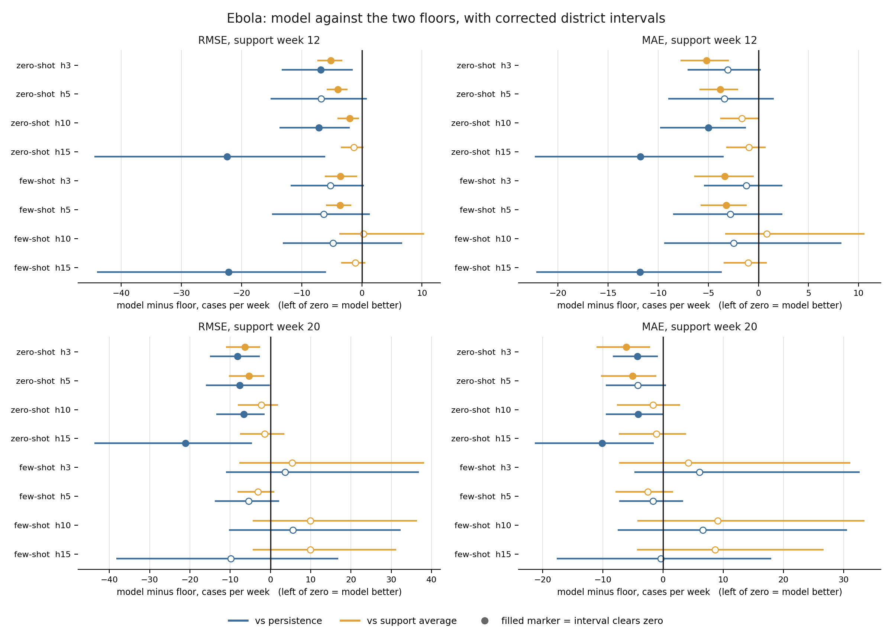
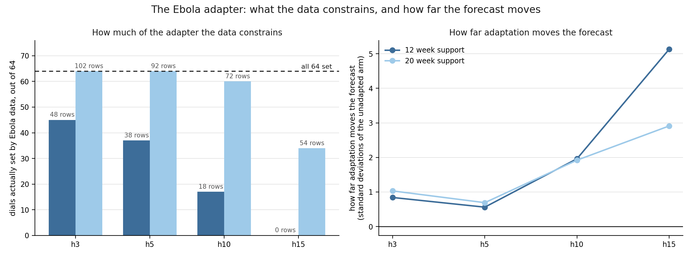
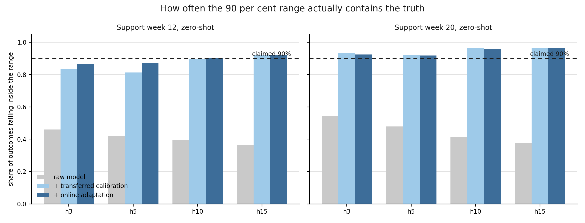

# Ebola Case Study, Calibrated Uncertainty and Explainability

## 1. Scope

This phase points the framework at the disease it was built for. Ebola covers 61 districts across Guinea, Liberia and Sierra Leone over 52 weeks of the 2014 outbreak, and it is the one disease held out of every stage of training, so the model has never seen a single Ebola observation during training. Four pieces of work were carried out on it: the case study itself, an investigation into why adapting the model on Ebola data makes it worse, calibrated uncertainty so the forecasts carry usable prediction intervals, and explainability showing what the model reads when it forecasts. All four are complete and no computation remains outstanding.

Two support windows were fixed in advance, of 12 and 20 weeks, controlling how much early outbreak data the model is allowed to learn from. The protocol and the data were fingerprinted before the run and the model was scored exactly once, so none of the results here were selected after seeing them. Prediction intervals are built by resampling districts. Everything else follows the previous phase: five random seeds, four forecast horizons of three, five, ten and fifteen weeks ahead, and country-macro aggregation.

| Work | Output |
|---|---|
| Ebola case study | 20 scored records and 20 quantile archives, both arms, both support windows, five seeds, from `train/ebola.py` |
| Why adaptation hurts | three diagnostics, each inference-only, reading no Ebola outcome and scoring nothing |
| Calibrated uncertainty | a calibration layer fitted across diseases and applied to Ebola, with district-level intervals rebuilt from the archives |
| Explainability | attribution across seven panel-arms at five seeds, with an independent cross-check |

## 2. What the model achieved on Ebola

Four things were scored: two support windows, and within each window an arm that was adapted on the Ebola support data and an arm that was not adapted at all. The unadapted arm is the strict case, because it uses no Ebola data at any point. It is the arm the headline result comes from.

Everything is measured against two floors, which are forecasts that need no model at all. **Persistence** says next week equals this week. The **support average** says every week equals the average of whatever was observed during the support window. A model that cannot beat both of these is not doing anything useful, whatever its raw error looks like.

### 2.1 The headline

With no Ebola data at all, the model beats persistence by 16, 15, 16 and 44 per cent at horizons of 3, 5, 10 and 15 weeks on the 12 week support window, and by 19, 17, 14 and 42 per cent on the 20 week window. Across the 32 comparisons against persistence, 14 clear zero on the corrected interval, and they span every horizon rather than sitting only at the long end. The adapted arm wins far less often, and on the 20 week window it wins nothing at all.

### 2.2 How to read the intervals, and why they changed

A single percentage is not enough on its own, because the model is scored on 61 districts and a few large districts can move the average. The interval answers a different question: if a somewhat different set of districts had been hit by this outbreak, would the model still have come out ahead? It is built by resampling districts ten thousand times and re-computing the comparison each time. When the resulting interval sits entirely below zero, the win holds up; when it crosses zero, the honest reading is that the difference could have gone either way.

These intervals replace earlier ones and are not directly comparable to them. The headline number is a node-averaged country macro, while the interval originally quoted was pooled across cells. Those are two different statistics, they diverge by 1.5 to 2 times, and the headline figure of 38.20 sat outside its own quoted interval. The interval is now rebuilt from the stored per-district forecasts and asserts that it matches the scored records before printing anything, so the point estimate and the interval now measure the same thing.

One consequence is worth stating. Ranking by seed spread and ranking by this interval do not always agree: they disagree on 9 of 32 comparisons on RMSE and 12 of 32 on MAE. Seed spread asks whether a different random initialisation would change the answer. The district interval asks whether a different set of districts would. They are different questions, and where they disagree the district interval is the one reported here, because it matches how the result is stated.

### 2.3 RMSE, all comparisons

A negative difference means the model is better than the floor. The units are cases per week.

| Support window | Arm | h | Floor | Difference | Interval | Clears zero |
|---|---|---|---|---|---|---|
| week 12 | zero-shot | 3 | persistence | -6.86 | [-13.33, -1.54] | yes |
| week 12 | zero-shot | 3 | support average | -5.20 | [-7.39, -3.25] | yes |
| week 12 | zero-shot | 5 | persistence | -6.75 | [-15.19, +0.81] | no |
| week 12 | zero-shot | 5 | support average | -4.01 | [-5.86, -2.41] | yes |
| week 12 | zero-shot | 10 | persistence | -7.14 | [-13.69, -2.04] | yes |
| week 12 | zero-shot | 10 | support average | -2.04 | [-4.05, -0.50] | yes |
| week 12 | zero-shot | 15 | persistence | -22.39 | [-44.46, -6.08] | yes |
| week 12 | zero-shot | 15 | support average | -1.34 | [-3.52, +0.29] | no |
| week 12 | few-shot | 3 | persistence | -5.21 | [-11.85, +0.35] | no |
| week 12 | few-shot | 3 | support average | -3.55 | [-6.16, -0.76] | yes |
| week 12 | few-shot | 5 | persistence | -6.36 | [-14.91, +1.34] | no |
| week 12 | few-shot | 5 | support average | -3.62 | [-5.97, -1.74] | yes |
| week 12 | few-shot | 10 | persistence | -4.82 | [-13.12, +6.72] | no |
| week 12 | few-shot | 10 | support average | +0.28 | [-3.73, +10.32] | no |
| week 12 | few-shot | 15 | persistence | -22.16 | [-44.03, -5.96] | yes |
| week 12 | few-shot | 15 | support average | -1.10 | [-3.41, +0.60] | no |
| week 20 | zero-shot | 3 | persistence | -8.17 | [-15.04, -2.60] | yes |
| week 20 | zero-shot | 3 | support average | -6.37 | [-11.06, -2.59] | yes |
| week 20 | zero-shot | 5 | persistence | -7.65 | [-16.01, -0.16] | yes |
| week 20 | zero-shot | 5 | support average | -5.35 | [-10.32, -1.55] | yes |
| week 20 | zero-shot | 10 | persistence | -6.63 | [-13.40, -1.41] | yes |
| week 20 | zero-shot | 10 | support average | -2.31 | [-8.05, +1.91] | no |
| week 20 | zero-shot | 15 | persistence | -21.14 | [-43.69, -4.56] | yes |
| week 20 | zero-shot | 15 | support average | -1.40 | [-7.56, +3.42] | no |
| week 20 | few-shot | 3 | persistence | +3.63 | [-11.07, +36.88] | no |
| week 20 | few-shot | 3 | support average | +5.43 | [-7.71, +38.12] | no |
| week 20 | few-shot | 5 | persistence | -5.42 | [-13.82, +2.16] | no |
| week 20 | few-shot | 5 | support average | -3.12 | [-8.22, +0.94] | no |
| week 20 | few-shot | 10 | persistence | +5.57 | [-10.35, +32.32] | no |
| week 20 | few-shot | 10 | support average | +9.90 | [-4.43, +36.38] | no |
| week 20 | few-shot | 15 | persistence | -9.83 | [-38.23, +16.79] | no |
| week 20 | few-shot | 15 | support average | +9.91 | [-4.44, +31.25] | no |

### 2.4 MAE, all comparisons

| Support window | Arm | h | Floor | Difference | Interval | Clears zero |
|---|---|---|---|---|---|---|
| week 12 | zero-shot | 3 | persistence | -3.05 | [-7.08, +0.23] | no |
| week 12 | zero-shot | 3 | support average | -5.18 | [-7.78, -2.93] | yes |
| week 12 | zero-shot | 5 | persistence | -3.40 | [-8.98, +1.55] | no |
| week 12 | zero-shot | 5 | support average | -3.82 | [-5.86, -2.03] | yes |
| week 12 | zero-shot | 10 | persistence | -4.98 | [-9.80, -1.25] | yes |
| week 12 | zero-shot | 10 | support average | -1.65 | [-3.82, +0.02] | no |
| week 12 | zero-shot | 15 | persistence | -11.77 | [-22.31, -3.48] | yes |
| week 12 | zero-shot | 15 | support average | -0.96 | [-3.23, +0.73] | no |
| week 12 | few-shot | 3 | persistence | -1.21 | [-5.45, +2.39] | no |
| week 12 | few-shot | 3 | support average | -3.34 | [-6.42, -0.48] | yes |
| week 12 | few-shot | 5 | persistence | -2.79 | [-8.51, +2.37] | no |
| week 12 | few-shot | 5 | support average | -3.21 | [-5.78, -1.16] | yes |
| week 12 | few-shot | 10 | persistence | -2.48 | [-9.42, +8.29] | no |
| week 12 | few-shot | 10 | support average | +0.85 | [-3.33, +10.58] | no |
| week 12 | few-shot | 15 | persistence | -11.81 | [-22.17, -3.65] | yes |
| week 12 | few-shot | 15 | support average | -1.01 | [-3.47, +0.83] | no |
| week 20 | zero-shot | 3 | persistence | -4.24 | [-8.33, -0.85] | yes |
| week 20 | zero-shot | 3 | support average | -6.10 | [-11.05, -2.15] | yes |
| week 20 | zero-shot | 5 | persistence | -4.17 | [-9.49, +0.49] | no |
| week 20 | zero-shot | 5 | support average | -5.06 | [-10.29, -1.08] | yes |
| week 20 | zero-shot | 10 | persistence | -4.12 | [-9.53, -0.04] | yes |
| week 20 | zero-shot | 10 | support average | -1.65 | [-7.64, +2.82] | no |
| week 20 | zero-shot | 15 | persistence | -10.13 | [-21.28, -1.52] | yes |
| week 20 | zero-shot | 15 | support average | -1.11 | [-7.34, +3.82] | no |
| week 20 | few-shot | 3 | persistence | +6.04 | [-4.73, +32.63] | no |
| week 20 | few-shot | 3 | support average | +4.17 | [-7.30, +31.13] | no |
| week 20 | few-shot | 5 | persistence | -1.66 | [-7.25, +3.36] | no |
| week 20 | few-shot | 5 | support average | -2.55 | [-7.88, +1.68] | no |
| week 20 | few-shot | 10 | persistence | +6.62 | [-7.56, +30.53] | no |
| week 20 | few-shot | 10 | support average | +9.10 | [-4.27, +33.45] | no |
| week 20 | few-shot | 15 | persistence | -0.38 | [-17.63, +17.99] | no |
| week 20 | few-shot | 15 | support average | +8.64 | [-4.32, +26.70] | no |

## 3. The target set before the run, and whether it was met

Before any Ebola forecast was produced, the target was written down, along with the exact data and protocol that would be used, and the whole thing was fingerprinted so it can be proved nothing was altered afterwards. This is worth doing because a model scored on four horizons and two metrics offers eight chances to find something positive, and picking the best one after the fact is not evidence. Fixing the target in advance means the result is whatever the named comparison says, win or lose.

The target was: the **adapted** model must beat persistence at either the 3 or the 5 week horizon on the 12 week support window, with the interval clearing zero.

**It was not met.** All four of those comparisons span zero.

| h | Metric | Difference | Interval | Clears zero |
|---|---|---|---|---|
| 3 | RMSE | -5.21 | [-11.85, +0.35] | no |
| 5 | RMSE | -6.36 | [-14.91, +1.34] | no |
| 3 | MAE | -1.21 | [-5.45, +2.39] | no |
| 5 | MAE | -2.79 | [-8.51, +2.37] | no |

Every one of those differences is negative, which means the adapted model was ahead of persistence on average in all four. That is not the same as passing. A pass needed the whole interval to sit below zero, so that the win would survive a different set of districts being sampled. The closest case is the 3 week RMSE comparison, whose interval reaches +0.35, meaning a plausible resampling of districts still leaves the adapted model slightly behind. It missed by about a third of a case per week.

There is a further point about the earlier reporting of this. On the statistic originally quoted, the criterion could not be judged at all, because the point estimate and the interval were measuring different things, as described in Section 2.2. With both now built from the same statistic, the criterion is properly adjudicable, and the answer is no.

The wins reported in Section 2 come from the zero-shot arm, which this target did not ask about. That arm forecasts an unseen disease using nothing but what the model learned from other diseases, and it beats persistence at every horizon on both support windows. The two results answer different questions: what transfers is the shared representation itself, and it transfers without needing any Ebola data to be fitted on.

## 4. Why adapting on Ebola data makes the forecast worse

The case study shows that fitting the model on early Ebola data produces worse forecasts than not fitting it at all. That result was measured but unexplained. Three diagnostics were run to explain it. None of them retrains anything, none reads an Ebola outcome, and none produces a score, so the case study result is untouched by all three.

### 4.1 What the adapter learns from, and what it is asked about

The adapter learns from the opening weeks of the outbreak, when almost nothing had been reported yet. Measured over those windows, 72.5 per cent of each input window on the 12 week arm is zero padding, and of the part that is not padding, only 5.2 per cent of cells carry an actual observation. The windows it is later scored on carry no padding at all and are 31.6 per cent observed.

So the adapter is tuned on near empty inputs and then used on full ones. It is calibrated with feathers and then asked to weigh bricks.

### 4.2 The fit does not have enough information to set the adapter

The adapter has 64 dials. Fitting it on the support data is only able to set as many of them as the data constrains, and on the 12 week arm the data never constrains all of them.

| Support window | h | Training rows | Dials set, of 64 | How far adaptation moves the forecast |
|---|---|---|---|---|
| 12 week | 3 | 48 | 45 | 0.84 |
| 12 week | 5 | 38 | 37 | 0.56 |
| 12 week | 10 | 18 | 17 | 1.96 |
| 12 week | 15 | 0 | 0 | 5.13 |
| 20 week | 3 | 102 | 64 | 1.03 |
| 20 week | 5 | 92 | 64 | 0.69 |
| 20 week | 10 | 72 | 60 | 1.92 |
| 20 week | 15 | 54 | 34 | 2.91 |

The last column is how far the adapted forecast lands from the unadapted one, measured in standard deviations of the unadapted arm, and it needs no labels to compute. Every dial the data never reaches keeps whatever random value it started with, because the protocol starts the adapter from scratch.

The 15 week row on the 12 week window is the clearest case. There are no training rows at all, nothing can be fitted, and yet the adapted forecast still lands 5.13 standard deviations away from the unadapted one. All of that movement comes from random starting values. A safeguard in the training code proves this must happen when there is no supervision, and it has been passing correctly throughout.

### 4.3 Why more data made it worse

The 20 week window has more than twice the training rows of the 12 week window, and at the short horizons it sets all 64 dials and is numerically well behaved. It is also the arm that performs worse. That looks backwards until the inputs are taken into account.

More rows from the same quiet early period do not make the inputs more like the ones the model is scored on. They only let the fit commit to that early period with more confidence. The result is that the 20 week arm moves the forecast further from the unadapted one than the 12 week arm does, in a direction set by a period the model is never scored in. The problem was never how many dials there are. It was what the dials were shown.

### 4.4 What this rules out

A development panel was given Ebola's exact arrangement: the same small sample, the same sparsity, the same padded windows and the same number of training rows at each horizon. Adaptation still helped there. Checking the archived records across five panels, five seeds and four horizons, the unadapted model beats the adapted one in 4 of 100 development cells, while on Ebola it wins most of them.

Development folds and Ebola therefore behave in opposite directions, and no development fold can stand in for Ebola on this question. Small sample size, sparsity and padded windows are each ruled out as sufficient explanations, which removes the three causes that would otherwise be reached for first.

What is established is that the region the adapter is fitted in is genuinely degenerate, and that the three obvious explanations do not account for the damage. The cause itself cannot be determined from within an emerging outbreak, which is itself why few-shot adaptation should not be trusted in that setting. That is a limitation of what the data can support, not a gap in the analysis.

## 5. Calibrated uncertainty

A forecast that says "180 cases" is not usable on its own. What a responder needs alongside it is a range, and a range is only worth having if it contains the truth as often as it claims to. A 90 per cent range that is right half the time is worse than no range at all, because it invites confidence it has not earned.

The model's raw ranges are exactly that. Averaged over seeds, its 90 per cent ranges contain the true value between 27.5 and 70.1 per cent of the time. The ranges are too narrow, and they get narrower relative to what is needed as the forecast horizon lengthens.

### 5.1 Calibration fitted on other diseases and transferred

The fix is a calibration layer, and the notable part is where it comes from. It was fitted on the five development diseases and never saw a single Ebola outcome, then transferred to Ebola unchanged. The method is split conformal calibration, which uses the errors the model made on other diseases to work out how much its ranges need widening, expressed as one multiplier per forecast horizon.

Transferred that way, it lifts coverage from between 27.5 and 70.1 per cent to between 65.1 and 98.0 per cent. A correction learned entirely on dengue, influenza and COVID therefore carries over to an unseen pathogen. That is the same finding as the point forecasts in Section 2, arriving by a different route: what transfers across diseases is the shared structure, and it transfers without Ebola data.

A second mechanism is layered on top, adaptive conformal inference, which adjusts the range week by week as forecasts are scored, widening it after a miss and tightening it after a run of hits. This lifts the weakest cells further and brings coverage to between 81.1 and 97.6 per cent, close to the 90 per cent claimed. The clearest case is the 15 week horizon on the 12 week window, where raw coverage of 0.275 becomes 0.651 under the transferred calibration and 0.811 once the online adjustment runs.

### 5.2 Coverage, zero-shot arm

Share of outcomes falling inside the 90 per cent range, averaged over five seeds. A perfectly calibrated range reads 0.900.

| Support window | h | Raw model | With transferred calibration | With online adaptation |
|---|---|---|---|---|
| week 12 | 3 | 0.460 | 0.833 | 0.864 |
| week 12 | 5 | 0.421 | 0.813 | 0.870 |
| week 12 | 10 | 0.396 | 0.896 | 0.904 |
| week 12 | 15 | 0.363 | 0.921 | 0.920 |
| week 20 | 3 | 0.541 | 0.932 | 0.925 |
| week 20 | 5 | 0.480 | 0.922 | 0.918 |
| week 20 | 10 | 0.413 | 0.964 | 0.959 |
| week 20 | 15 | 0.375 | 0.966 | 0.963 |

The adapted arm behaves the same way but from a less stable starting point. Its raw coverage swings from 0.275 to 0.701 across cells, and after both corrections it lands between 0.811 and 0.980. The corrections work on it, but the raw ranges they are correcting are far more erratic than the zero-shot arm's.

### 5.3 What it costs, and what it does not promise

Correct coverage is bought with width. Applying the transferred calibration roughly doubles the width of the ranges, and adding the online adjustment widens the weakest cells considerably further, in the worst case around fivefold. This is the honest trade: the model was quietly understating its own uncertainty, and stating it correctly means saying something less precise. A range that is wide and right is more use to a responder than a narrow one that is wrong.

One limit belongs with the result. The calibration multipliers were fitted on other diseases and transferred, so there is no finite-sample guarantee that they are correct on Ebola. Whatever guarantee exists comes from the online adjustment, which corrects itself against Ebola outcomes as they arrive, rather than from the transfer itself. The tool prints this alongside its own output, and in theory coverage may sit up to 0.167 away from nominal over a run of this length.

## 6. Explainability

Explainability answers a different question from accuracy: not how close the forecast is, but what the model reads when it makes one. The method used is integrated gradients, cross-checked against a second, independent method called occlusion.

### 6.1 Why integrated gradients, now tested rather than argued

The previous phase set out a case for using integrated gradients instead of SHAP, the method originally named for this work. That case rested on reasoning. It has since been tested by running both methods on the same frozen model from the same reference point, and the reasoning held.

**SHAP does not fit the size of this problem.** One complete read of the largest panel works out at roughly 14,000 GPU hours.

**At an affordable budget, SHAP does not agree with itself.** SHAP samples, so its answer depends on the draws it takes. Run twice on the same model and data, at a budget affordable across this many districts, two runs agree only at 0.68 on a scale where 1.0 means identical. Integrated gradients scores 1.000000 against itself, because it does not sample, and takes under a second for every district at once. The standard on this project is that any number in a document can be recomputed and must come out the same, and a method that lands somewhere different each run cannot be audited that way.

**SHAP asks the model questions that have no real-world answer.** One input records whether a district reported that week, and it is tied to the case count: a district that did not report has no count. SHAP hides inputs independently, so it builds weeks saying "this district did not report, and here is the number it reported". Between 41.6 and 44.9 per cent of its sampled inputs contain at least one such impossible week, and whatever the model answers there is guesswork folded into the explanation. Integrated gradients fades all four inputs together along one path, so its intermediate points are partial but never self-contradictory.

**Where both can be run, they agree.** On the five busiest Ebola districts both methods were run properly and picked the same top factor five times out of five, with detailed agreement between 0.96 and 0.99. Integrated gradients returns the same answer as SHAP, around fifteen thousand times cheaper, and identically every run.

### 6.2 What the model reads

Attribution covers seven panel-arms at five seeds, run against the existing trained models with no retraining.

Past case counts are the top input on every panel, at a share between 0.405 and 0.631. The five weeks before the forecast carry between 0.483 and 0.761 of the attribution, against 0.080 to 0.195 for weeks sixteen to twenty. Seasonality weighs more on every influenza panel, 0.385 to 0.482, than on either Ebola arm, at 0.266 and 0.275, which is what a strongly seasonal disease and a single twelve-month outbreak should produce.

Three predictions were written down before the run and all three passed: past case counts top everywhere, recent weeks outweighing distant ones, and seasonality mattering more for influenza than for Ebola. The occlusion cross-check removes an input and measures the change in the forecast, so it shares no machinery with the gradient method; the two agree on the top input and top time window in 264 of 280 checks. Attribution is reported in five-week bands rather than single weeks, because untrained models reproduce the week-by-week pattern at a correlation of 0.91 to 0.96, which shows that pattern reflects the model's internal structure rather than anything epidemiological.

## 7. The normalisation mismatch

One threat to the results is worth stating openly, because it comes from the data pipeline rather than the model.

The shared trunk was trained on inputs scaled district by district, so each district sits centred on zero. Ebola arrives under a single pooled scale instead, leaving its districts about 0.70 away from zero on the 12 week window and 0.63 on the 20 week one. The model is therefore fed inputs shifted away from the ones it learned on.

Two experiments tested this in both directions, neither retraining anything. Scoring the development diseases the Ebola way cost accuracy at every horizon on all four panels, from 4.6 to 101.5 per cent worse on MAE, so the mismatch is measurably harmful in exactly the direction Ebola experiences it. Scoring Ebola the development way never helped: across five seeds nothing beat the shipped configuration in any of 40 paired cells, and the short horizons were 10 to 19 per cent worse on every seed.

The distinction that matters is between mismatched and consistent scaling. Where a model is trained and scored under the same pooled scale, pooling helps, by 6.8 per cent on the matched panel. Only the mismatch costs anything.

The wins over persistence in Section 2 are untouched by this, because the naive floors are scored in raw case counts and never pass through the scaler at all.

This stands as a stated threat rather than a defect to be fixed. A genuine per-district scale requires historical data Ebola does not contain, the closest available approximation is strictly worse, and the pre-registered configuration remains the best of every alternative tried. Whether the mismatch also accounts for the adaptation failure in Section 4 is a question this dataset cannot answer: settling it would need Ebola history from before the outbreak, which is exactly what an emerging disease does not have.

## 8. Summary

The framework was run against Ebola once, under a target fixed before the run. Forecasting a disease it had never trained on, using no Ebola data at any point, it beat the do-nothing forecast at every horizon on both support windows, and 14 of those 32 comparisons hold up when the districts are resampled. Fitting the model on early Ebola data made it worse, and three diagnostics explain why: the adapter learns from windows that are almost entirely empty and is then used on full ones. Removing the spatial connections between districts never improved the error in any of 60 cells, so the graph is not what carries the accuracy either. Explainability confirmed the model reads recent case counts above all else.

The strongest result is the calibration. The model's raw ranges were overconfident, containing the truth around half the time while claiming 90 per cent. A correction fitted entirely on dengue, influenza and COVID, which never saw a single Ebola outcome, brings that close to the 90 per cent claimed. The finding arrives twice by different routes: what transfers to an unseen pathogen is the shared structure, and it transfers without any data from that pathogen, which is exactly what is needed at the start of an outbreak, when there is nothing yet to learn from.
